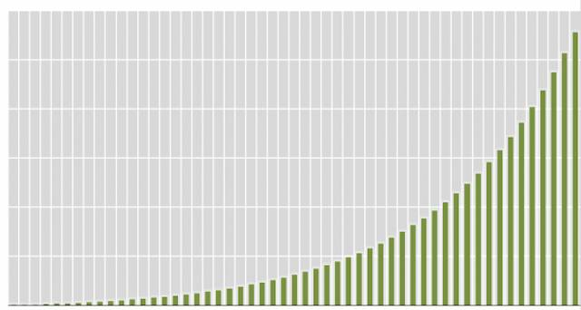
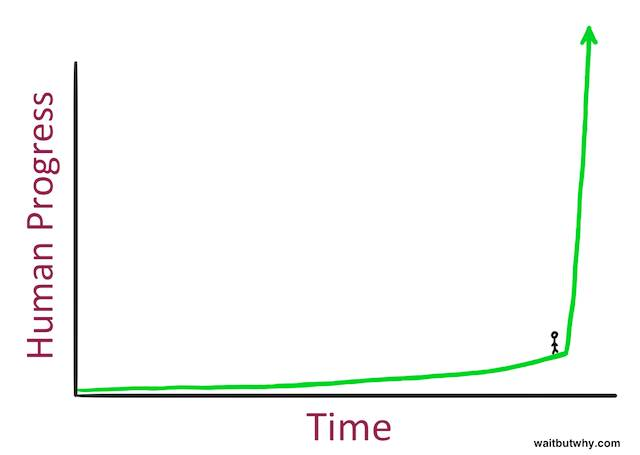
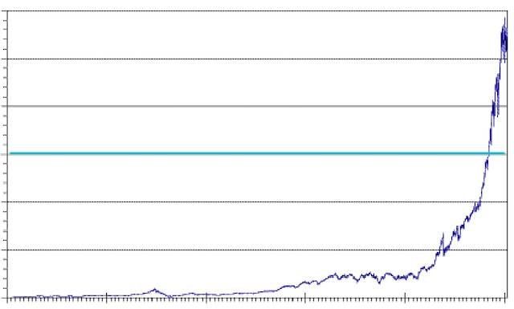
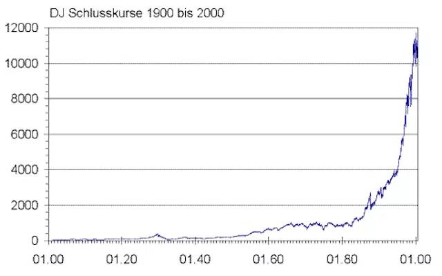
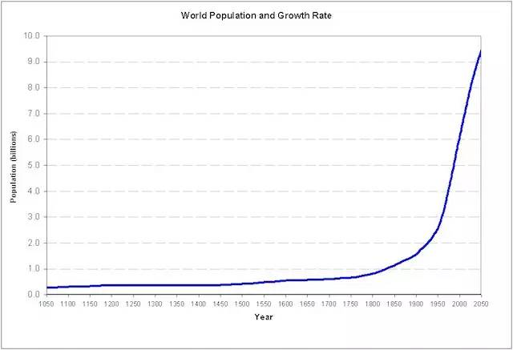

# 人生最重要的概念：复利
 
 爱因斯坦说过这么一句：
 
 > “Compound interest is the eighth wonder of the world. He who understands it, earns it ... he who doesn't ... pays it.” 复利是世界第八大奇迹。知之者赚、不知之者被赚。
 
 对于绝大多数人来说，复利只不过是高中数学课本里的一个章节概念而已[^1]，做几道应用题之后就再也跟自己的生活全无关系了。别说复利了，事实上，连利息都不见得是每个人都真正完全理解的。
 
 利息，毋容置疑，在今天这个世界，是个极为简单的概念，但也恰恰因为如此，它是个极好的例子，可以用来说明：
 
 >**无论多么简单的概念，都是人类耗费许多年（甚至几千年）才逐步弄明白，并通过反复遗忘、反复教育、反复更迭才彻底弄明白的……** 
 
 人们普遍自然而然地接受利息的存在（或者说“单利计算”），其实也不过是近一百年以内的事情。在中国人的印象里，“利滚利”这种缺德事儿是黄世仁那种混蛋为了霸占喜儿才干得出来的；在西方人眼里，莎士比亚笔下的夏洛克代表着邪恶……
 
 试想一下，如果在几千年前，某人向村里另一人在春天的时候借了一点种子，到了秋天的时候，归还种子的时候，是不是会自然而然地多还一些粮食？
 
 又或者，某人借的是母鸡，等母鸡下蛋孵出来小鸡之后，是不是要多还几只小鸡？借鸡生蛋之后把鸡还回去、蛋全部留下来，恐怕估计是会挨打的罢？
 
 可借钱的时候，人们却不愿意付利息，为什么呢？最根本的原因只不过是笨蛋们的特点自古到今都是一样的：
 
 >**哪怕只要多复杂一层就开始完全无法理解，更别提复杂一层以上了……** 
 
 笨蛋去找朋友借一只鸡，可是朋友也只有一只鸡，而家里的娃天天等着鸡下蛋吃。于是朋友想到自己还有十个贝壳，在市场上可以换到一只母鸡，于是就好心借给笨蛋。然后，笨蛋去市场上用十个贝壳换了只母鸡，鸡生蛋、蛋生鸡，过了一段时间，想起来当初的事儿，于是抱着一只生出来的母鸡去市场上换了十个贝壳，拿回去还给朋友。朋友说，嗯？你应该给我至少二十个贝壳吧？笨蛋愤怒了：你怎么可以这么无耻？！你明明借给我的是十个贝壳！那些贝壳不借给我，放在那里也是放着，难道它们会自动变成二十个？我那些鸡可是我辛辛苦苦养出来的，你什么都没干，就多要十个贝壳？！你太坏了……
 
 笨蛋之所以总是理直气壮，是因为他们思考不全面却以为已经全面。笨蛋忘了，那朋友其实可以拿着十个贝壳自己去市场上换一只鸡，然后同样可以鸡生蛋、蛋生鸡……然后换回来更多的贝壳 —— 虽然贝壳看起来是死的，放在那里也不会“自动”生成新的贝壳，但这并不意味着说那些贝壳如果不被笨蛋借走的话就一定永远只是放在那里。
 
 >**别笑，别以为自己不是笨蛋，我们每个人都有可能是，或者必然曾经是。** 
 
 整体来看，即便是到了今天，绝大多数人对利息也没有正确的认识。迄今为止，地球上也就只有一个民族，其中的每一个人，好像自古至今都对利息有着透彻的了解：犹太人 —— 爱因斯坦就是犹太人。嗯，莎士比亚笔下的夏洛克也是犹太人。
 
 从历史上来看，犹太人长期受迫害，若干次被种族清洗的最根本原因就是他们放高利贷，招人恨 —— 说穿了，是招笨蛋们恨；而那些笨蛋中，几乎无所不包：科学家、哲学家、道学家、政客、强盗和平民百姓。
 
 地球上的每一个宗教，至今都有严格的教义，禁止收取利息。甚至，连精通利息理论的犹太人，也并不一定认为收取利息是“光明正大”的。正因如此，他们的教义里规定，不得向同族收取任何利息，只允许向外族人收取利息。导致外界的笨蛋一致认为聪明的犹太人是“昧着良心赚钱的民族”…… 人们把放高利贷的人，叫 Loan Shark，就是广东话里的“大耳窿”[^2]，反正一听就都不是好东西……利滚利，听起来就更邪恶了。
 
 即便到了今天，虽然说现代金融学的基础，就是承认并接受利息的存在，并也无处不在应用复利原理，可是，全世界的银行大多都在吸储的时候只支付单利，而不是复利 —— 这是他们在故意占便宜。白占便宜是很不厚道的，于是，他们想尽一切办法教育大众，放高利贷是不好的，这话还真的部分是正确的…… 于是，老百姓基本上都信了，有意无意地都把复利和高利贷等同于一回事儿。而所有的政府也都是一样的，出于控制经济的需求，要严格控制利息，恰好又帮了银行的忙，于是老百姓普遍不是很清楚地理解利息就很正常了 —— 要命的是，还真没有人认为自己连利息是什么都不懂……
 
 可“利滚利”就是很正常的一个概念啊**复利** 。一笔存款，若是可以获取复利，那么它的增长最终大抵是这样的：
 
 
 
 于是，一笔借款，若是按复利计算，拖欠得越久，就越有可能变成永生永世无法偿还。所以借钱还不上，从这个角度看，只能是愚蠢无能造成的，怪不得别人 —— 这话难听，但话糙理不糙。而有钱却赚不到钱，也是一样的原因 —— 只能这么理解。
 
 从另外一个角度来看，有继承资产的好处（大多数人无法享受的好处）就是有可能很早理解利息的原理，以及复利的神奇力量。我个人几乎从未直接从钱上获得过“复利”的神奇力量支持，为什么呢？因为我根本没有任何可继承的资产。不仅如此，三十五岁之前，总是反复被清零……
 
**不过，万幸的、也是公平的是，每个人都一样，在智力上、知识上、经验上，复利效应依然存在的 —— 这是多么令人喜出望外的事实啊！** 只要能积累的东西，基本上最终都会产生复利效应。如果没有继承资产，那么就持续积累知识罢，我们运气真的很好。
 
 >**我们恰恰活在一个知识变现很容易、且越来越容易、且变现金额越来越大的时代。** 
 
 
 
 2015 年，有一篇很流行的文章《[为什么最近有很多名人，比如比尔盖茨、马斯克、霍金等让人们警惕人工智能？](http://t.cn/RwhdDsT)》，里面的主要观点我个人并不同意，但里面的一个论据很有意思，同时也是正确的：
 
 > 我们正站在人类社会发展的拐点上……
 
 这是为什么我们认为自己活在最好的时代（根本不是最坏的时代）的重要原因，人类的知识和经验经过漫长的反复修正积累，终于开始进入高速发展时期了，而我们恰好生在这个时代（而不是石器时代）……
 
 2013 年年底，我开始从事天使投资工作 —— 我从来没想过自己能做的事情。随着时间的推移，我渐渐形成了属于自己的相对固执的看法[^3]，其中一个是：
 
 >**不能很快地赚到很多钱的商业计划就是垃圾。** 
 
 请注意：这里的**很快** ”，若是不仔细多方面周全地解释，一定会引起误会。因为有人会疑惑，那 Amazon 到了 2014 年才开始盈利，难道 Amazon 上市前的商业计划是垃圾吗？
 
 
 
 若是 Amazon 若干年来的营收曲线是这样的，穿过绿线之后就是盈利状态，那 Amazon 的商业计划就是成功的、且高价值的 —— 因为它一旦开始赚钱，一年就把之前若干年的亏损全赚回来了…… 你说快不快？Peter Thiel 当年做 Paypal 的商业计划的时候，清楚地知道，按照计划，Paypal 的 90% 以上的收入来自于第 19 年…… 也是一样的道理，他们寻找的是遵循这样模式的、复利曲线式的增长。
 
 所以，我经常跟我的合作伙伴们说，
 
 > 商业的核心就是赚钱，赚大钱的模式就是寻找这样（复利模式）的曲线……
 
 其实，上图并不是 Amazon 的营收曲线（我是故意的），而是道琼斯指数过去一百年的增长曲线：
 
 
 
 这种曲线在很多地方都是一样的，例如，世界人口增长曲线也是这样的：
 
 
 
 我的幸运在于，我很早理解并相信了复利的力量 —— 而且是在没有继承资产的情况下。我选择了知识积累，并且笃信知识的效用 —— 我知道、我相信，**许多年后**的某一天，知识会变现的，而且它一旦变现，很可能瞬间就能抵消过往所有的挫折。结果呢？所谓的“**许多年之后** ”，在我 39 岁那年（2011）的时候来临了……
 
 在《把时间当作朋友》中，我反复鼓**积累**，在《新生 —— 七年就是一辈子》里，我还会继续反复鼓吹，不仅要陪伴更多的人一起积累，还要继续传播这个简单、朴素、有效的思想。一旦你擦亮了眼睛，就会发现**复利效应** 其实无所不在 —— 甚至毫不夸张地讲，复利效应，是我们人生的希望。
 
 

 
 [^1]: 在《把时间当作朋友》第七章《应用》的最后一节，我也说过同样的话。
 [^2]: 大耳窿，我猜是“dare loan”的音译？
 [^3]: 在投资领域，有些看法只能是自己的。虽然常常无法向所有人证明自己是对的，但自己却愿意“以钱试法”……