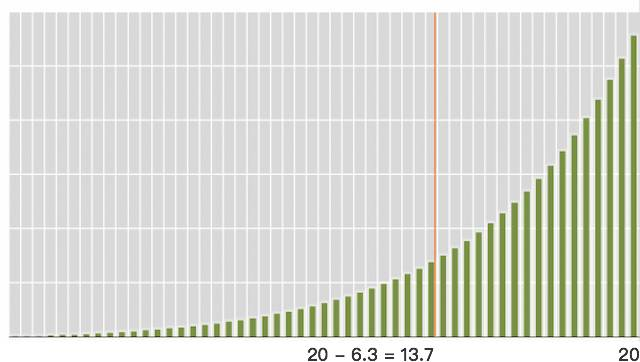

# 最根本的学习与创作：践行
 
 践行，就是字面上的意思，
 
 >**实践与行动。** 
 
 想到了，就去做，做到了，才算践行，做不到，没用。
 
 大约从 1986 年开始，我很讨厌过春节，很朴素的原因，就是觉得真浪费时间啊…… 那个时候，罗永浩就表示很不理解，奇怪我为什么一到过年的时候，就找个宾馆躲进去 —— 这真是个怪人！
 
 其实很安静的，一口气可以好几天安静地想自己的事儿，看自己的书，睡自己的觉…… 多年后回望过去，最庆幸的是什么呢？16 岁之后，我再也没看过中央电视台的春节联欢晚会，那东西比现在北京的雾霾还可怕。算下来，我比同龄人多活了至少一个多月了罢？
 
 1995 年，我大学毕业。几乎从毕业那一天开始，我变成了别人眼中的工作狂 —— 因为我没有休息日，我每天都在工作，春节也不例外。
 
 这事儿我身边的人都知道。
 
 > - 《托福核心词汇 21 天突破》最后的突击成稿，就是在 2003 年的春节完成的。《把时间当做朋友》最初一稿，还叫《管理我的时间》的时候，是 2007 年春节……
 
 > - 2008 年年初，我和朋友合伙开了个留学咨询公司，在数码大厦租了个办公室，交完房租，就是装修，花不了几个钱。装修差不多了，就春节了。于是大家都去过年。等他们回来的时候，我已经在这期间接了几个客户，讲了一小期班，收上来的钱已经使得公司产生了盈利。
 
 > - 2010 年春节，一口气在两周内整理完《[人人都能用英语](http://zhibimo.com/books/xiaolai/everyone-can-use-english)》，以及《[把时间当作朋友](http://zhibimo.com/books/xiaolai/ba-shi-jian-dang-zuo-peng-you)》的修订……
 
 > - 2013 年年初，我和两个小伙伴组建了 Knewone，网站上线后没多久，就是春节。他们俩一个去了香港，一个去了柬埔寨，度假。我在家里充当客服…… 等两个小伙伴回来，网站的流量已经冲进 Alexa 全球排名 5 万以内了。
 
 > - 修订这段文字的时候，是 2016 年春节，大年初三。这几天正在整理《新生 —— 七年就是一辈子》的文稿…… 其实整理工作远比写文章难多了。
 
 我就是这样的。可实际上**我并不讨厌给自己放假的啊。** 只不过，我觉得“法定”这事儿对我来说没意义，那所谓的“法定”是制约企业的，又不是制约我个人的。我什么时候该休息，应该是我说了算啊。手里本来有要做的事儿，结果可倒好，法定要求休息，我就休息了，那手里的事儿怎么办？在不得不与他人协同的时候，法定假日更是气人，活生生把很多事儿给搅黄，且每个人都不在乎 —— 他们说他们有他们自己的生活。
 
 > 以前在新东方讲寒假班的时候，每期班结束的时候，总有一些学生跑来理直气壮地索要最后一节课的讲义，说，“我要赶回去过年……” 我就乐：“嗯，过吧，好好过，使劲过，以后你就年年都在家过年罢！还留什么学啊？”
 
 你知道一年有多少个节假日吗？很多人还真不知道，也没好奇一下去查过。算上周末双休日，一年下来，“法定节假日”大约 115 个。
 
 从 1995 年，到现在 2015 年年底，算 20 年罢。
 
 > 115 × 20 = 2,300 （天）
 
 也就是说，这些年下来，我比别人多了 2,300 个工作日。我多做了很多事情、做了更多事情，这有什么可奇怪的呢？
 
 假设多出来的每个工作日里，我每天工作时间只有 6 个小时 —— 虽然肯定比这个长，但也不可能是 12 小时以上啊；然后，我也是干一会儿玩儿一会儿啊，要不然怎么会弹吉他呢？
 
 > 2,300 × 6 = 13,800 （小时）
 
 那么，我比大多数人多工作了 13,800 小时。什么“一万小时”理论之类的，不是没道理，但在我这里确实没劲，弱爆了。
 
 > 2300 ÷ 365 = 6.3 （年）
 > 20 ÷ (20 - 6.3) = 1.459 （倍）
 
 于是，过去的 20 年里，我那 20 年的时间密度是大多数人 20 年的 1.459 倍，凭什么我不多收获一些呢？其实我也一样贪玩的，我也一样偶尔松懈的，只不过，24 小时里，你怎么可能除了睡觉全在松懈？我觉得这也挺难的。
 
 
 其实我一定不是他们以为的那种工作狂。就算是，可谁说工作狂没有生活啊？好奇怪。
 
 每天都要成长，每天都要进步 —— 这就是我的工作。我觉得挺好的，没觉得累，没觉得辛苦，反过来，倒是觉得不这样才没意思。不进步的人哪儿有幸福？不认真思考不切实践行的人，连性生活都可能是低级的……
 
 > 《[挤挤都会有的](http://t.cn/Ry7fpEf)》是我写的第一本“共创书籍”…… 其实，我只写了一个字，然后副标题都要一句话：一个字足以改变生活品质。
 
 我读书量和阅片量不是一般地大。读书是应当的，没啥可说。可阅片这事儿可以拿出来好好吹吹牛。当年在新东方与同事打麻将的时候，聊聊天，他们都很惊讶，因为但凡他们听说过的电影我都看过。打麻将，我随叫随到，人称麻圈及时雨，任何时候三缺一，给李笑来发短信…… 我也不是没事儿干，但我觉得就那么几个好朋友，配合着开开心，这不是好朋友的基本义务么！到了年底，我又出了一本书…… 他们就又很奇怪，“这小子哪儿来那么多时间啊？” 很简单啊，真的不是靠熬夜挤时间的（虽然有时候也熬夜），不休法定节假日就可以了啊！真的多出很多很多时间的。
 
**想到了，就按照正确的想法做了 —— 不管别人是否理解 —— 这就是践行。** 这并不是什么需要“坚持”的事儿，这只是“是否对得起自己”的事儿而已。不是吗？这明显是有[复利效应](A01.md)的事儿啊！那是我 20 年前就算过的事儿，现在只不过是被我活出来了而已。
 
 
 
 想要看到复利的效果，就必须有足够长的时间，而且越往后效果越显著。时间是不可管理的，于是，就只能想办法提高自己的工作效率和生活质量 —— 显然，我的做法是划算的。在时间轴上我已经走过 20 个刻度的时候，别人还在 13.7 以内晃荡，更多的人可能连 5 个刻度都没走过…… 复利效果在我身上更为显著，这明显很自然啊。
 
 过去很少跟别人讲这个事情[^1]。这种想法说出来，得到的反馈无非是“笑来，你对自己真狠”之类的其实莫名其妙的评价。都已经活过来了，20 年过去了，我可以拿这事儿开玩笑了：
 
 >**我这哪里是对自己狠啊？这根本就是对自己的爱惜啊！** 
 
 现在是 20 年过去了，我拿出来说说事儿，效果是明显的；可若是在 2005 年的时候，10 年的效果就没那么显著了，1995 年的时候我说出来，有几个人会当回事儿？—— 说出来肯定会被人笑话的罢……
 
 难道不是吗？践行的人生与绝大多数人的生活并不兼容，这是没办法的事情。相互之间也没必要羡慕**选择之后就是不可逆的** ，没办法的事儿又何必羡慕？20 年前我遇到的那些人，根本就不会理解我的这些想法，尽管这些其实都是非常简单的推理之后得到的朴素结论。就算理解了，又怎样？他们也不会去做，当然更不会相信我能做出来。等我做出来了，他们再信有什么用？
 
 >**想到了，学到了，就当真了；当真了，就当真做了，且真的做到了，这才是践行。** 
 
 有一句话，特好玩，也是对的：
 
 >**每个人都是出生的时候，都只能是原创。结果，绝大多数人活着活着就一不小心把自己活成了盗版……** 
 
**践行才是真正的学习与创作。**  很多人一生都不懂这个道理。算清楚 20 年有多少个法定节假日，想想如果能按自己的方式安排时间会多出多少工作时间，这事儿用不着高等数学去计算罢？想得到却没有做，那就怪不得谁了。
 
 这次开写《新生 —— 七年就是一辈子》，才发现我不小心把自己活成了行为艺术家 —— 才发**讲道理的人很多，践行的人很少很少。** 少到什么地步呢？只要真的做到了，甚至可以被称为“行为艺术家”的地步。
 
 钱花掉了，才属于自己，时间度过了，才可以算进生命，这是朴素的道理。
 
 这 20 年，我过的很开心，很好很强大，越来越从容。明天的事儿，谁知道呢？—— 我自己知道。
 
 
 

 [^1]: 做到了再说，否则说了也白说。要想尽一切办法成为“能说那话的人”。