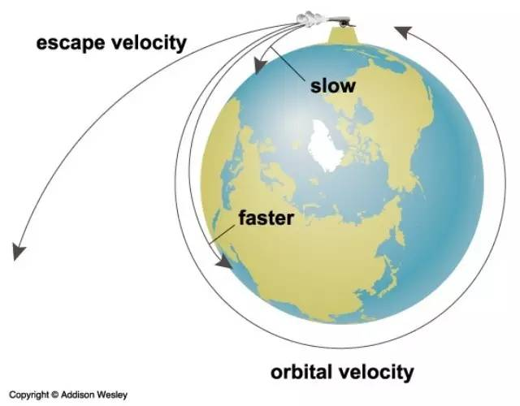
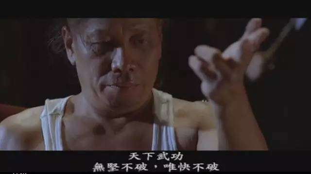
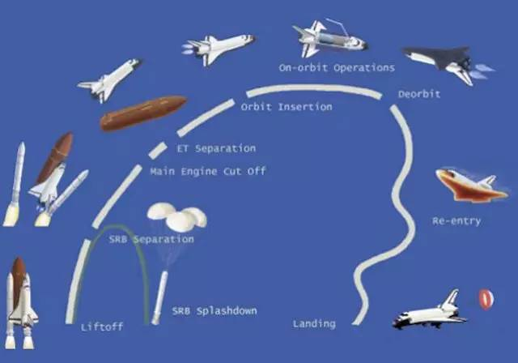

# 我是如何获得财务自由的？
 
 上高中的时候，物理书里（应该是高一第一册），有个重要的概念，“逃逸速度”（Escape Velocity），又叫做第二宇宙速度（Second Cosmic Velocity）。这个概念太迷人了，让我无法不浮想联翩，直到今天（以及在可预见的未来中），它都是我最喜欢的概念之一。
 
 
 
 运用之前对速度、加速度、动能、势能、圆周率等等这些基础概念，我们可以清楚地计算出第一宇宙速度是 7.9 km/s —— 用这个起始速度发射，航天器可以环绕地球飞行；若是起始速度超过 11.2 km/s，即超过第二宇宙速度，那么航天器可以摆脱地球引力的束缚，飞离地球…… 第三宇宙速度，16.7 km/s，可以让航天器飞离太阳系，第四宇宙速度，大约应该是 52.5 km/s，能飞离银河系……
 
 上学的时候，我的书看起来一直都是新的，因为我习惯了[开学拿回来新书之后，先把每一章的概念囫囵吞枣地死记硬背下来，而后就把书扔在那里，偶尔听听课，偶尔跟着做做题就完事儿了](A10.md) —— 如此看来，学校实在是太好混了。那时候，我看同学们拿回新书第一件事儿是给它包个书皮就觉得好笑，也很自得，因为觉得自己暗藏了一门保护书籍的秘籍。
 
 可这一次我实在忍不住了，看着那几个数字就觉得神奇，忍不住一定要搞明白整个计算过程；几天时间不知不觉就一晃而过，我已经把整本书彻底翻完。那应该是我人生第一次“高速学习”的经历，虽然囫囵吞枣，但也感觉一路披荆斩棘。这次的学习过程成就感太强 —— 恍然间觉得自己的“保护书籍”的方法论，其实一直一来就使得我的学习速度超越了“第一宇宙速度”，而这一次的高密度学习过程，让我感受到了“逃逸速度”……
 
 那时候，小朋友们还不知道有“脑洞大开”这么个说法，身边真的没有谁可以交流这个神奇的过程与奇妙的感受。尝试着跟同桌说了一回，发现再说下去有被仇恨的危险，于是就闭嘴了。
 
 过了好多好多年，看到周星驰在《功夫》里有这么一句台词：“天下武功，无坚不摧，唯快不破”…… 真心不觉得这话装逼捣蛋，知道确实是那么个理儿。
 
 
 
 我很早就想办法赚钱，而且也确实能想到办法。还在大三的时候，在报纸上看到长春火车站附近有个新建但尚未完工的华正批发市场正在招商，我就跑去找华正的总经理，说，我可以回老家帮你们招商，你们给我多少提成呢？那个身材高大的女经理愣了一下，说，你年纪这么小，行吗？不过，要是你能做到，我们签个合同，给你 10% 的提成。拿着合同我就请假回老家延吉了，借钱在延边日报上发了个广告，然后在市内最好的宾馆里租了个房间，开始“招商”。一周前后的时间里，我卖了二十多万，拿到两万多提成，我没要现金，换了个位置不错的小柜台出来 —— 那是1994 年。罗永浩同学当时辍学在家，见证了整个过程，好像那报纸上的广告就是他跑去找了个人发的。
 
 那时候我就跟朋友说，赚钱一定要快，不是因为我们贪，是因为我们懂道理，物理书上说的，想要摆脱地心引力飞出去，得超过第二宇宙速度…… 我赚钱的速度一直很快，帮华正批发市场招商，让我第一次赚到了“万元”以上级别的钱，还是在前后十天之内；后来做过很多事情，也都很多也都很快……
 
 虽然这个类比倒是不错，可实际上，赚钱速度要多快才能达到“第二宇宙速度”是没办法像物理书里那样有公式可以计算出来的。而且，事实上，财务上的“重力加速度”远远超出一个年轻人的想象。
 
 一九九七年前后的时候，我已经赚到百万级别的现金 —— 那时候我已经是金鹰板卡的东北区总代…… 可一场突如其来的事件，在接下来的两三年里，让我的积蓄迅速归零 —— 我父亲病倒了。这个过程中，我对医疗商业化这个政策有了深刻的理解，也见证了很多人真的在生了病之后因为没钱治疗而不得不回家等死…… 到了二〇〇〇年前后，我已经彻底“青皮”（东北话，一无所有、身无分文的意思），于是只好想办法去找一份高收入切稳定的“工作” —— 后来去了新东方呆了七年，那是我人生中唯一一次打工的经历。
 
 其实，在一九九五年的时候，我遇到过另一场“灾难” —— 我们几个朋友在华正经营服装批发赚来的钱“消失”了。因为是坏事儿且涉及到朋友，这事儿即便是在今天，我也不愿意公开说出细节，反正结果就是十来万块钱消失了…… 一年多白干。不仅白干，还有负债。这直接导致了大学毕业之后的我不可能去“找个工作”。那时候在银行工作，每个月的工资也不过几百块钱，靠那点薪水，我一辈子都别想还清债务。压力是可以转换为动力的，没有这些压力，我可能真的去找工作了，可有了这种压力，找工作是不可能的，于是我只好想办法去做生意 —— 那时候人们不用“创业”这个词 —— 辗转了几下，跑去沈阳的三好街，从卖光盘开始……
 
 父亲病倒之后，我卖掉了在沈阳三好街的柜台、档口和公司，回老家。在那三年里，我在延吉开过电脑公司，办过网吧…… 反正就是想办法赚钱，心里想着，这都不是我的错，这是“自然灾害”、“不可抗力”而已。最终，我还是有办法比别人更快地赚钱。我在网上读到一篇英文文章，一晚上弄明白了如何搭建无盘网（RPL、PXE 现在已经是没几个人知道的概念了），搭建一个网吧的成本比别人低出一大截，于是利润当然高了一大块…… 可好景不长，先是遇到一个叫邹连军的骗子（人被骗之后是不好意思告诉别人详细的受骗过程的），再后来遇到一个赵姓的警察，禁止我再搭建无盘网，原因不详。我再次彻底归零，并再次负债。这是一九九九年年底……
 
 所以，在新东方的七年，是我安心休整的七年。无论在新东方我遇到过多少恶心事儿，我都一直感激我的前老板俞敏洪，因为那点事儿跟我在外面遇到的比起来真的“屁都不是”。新东方虽然课酬很高（相对于整个培训行业），但对我来说是不够的，于是我开始琢磨不受“重力加速度”限制的事情 —— 写书。如果不是在新东方那样的环境里，我是万万不可能做到的…… 再后面的事儿，我的长期读者都知道，因为差不多[从 2002 年开始，我算是在网上完全公开工作的](A04.md) —— 虽然在相当长一段时间里，我从来不在网上讲述自己的个人生活[^1]。
 
 所以，形象点地讲：
 
 >**赚钱慢是一种罪，原罪。** 
 
 因为财务上的“重力加速度”相对来看太狠了，大多数人不知道而已；你赚钱少，你赚钱慢，你就永远“飞不起来”，更别提“飞出去”了…… 有一年崔健发了首歌，最后一句歌词是“我飞不起来了”，听到那句的时候，我的眼泪一下子掉了下来。
 
 财务上的“重力加速度”，林林总总包括很多，主要包括：
 
 > - 无继承资产
 > - 债务与利息
 > - 欺骗与背叛
 > - 间或一定发生的灾难
 > - 税务与保险
 > - 必需品开支
 
 航天飞行器怎么飞起来的呢？科学家们要考虑的是这么几件事情，航天飞行器的重量、起始的速度、可携带的燃料数量 —— 要命的是燃料箱本身也有重量…… 所以，科学家们想出来的办法是，飞到一定高度之后，把一节燃料箱丢弃掉（jettison），降低飞行器的重量；再飞高一段距离之后，还要再丢掉另外一节燃料箱……
 
 
 
 这是个多么有启发的方法论啊！
 
 在很长的一段时间里，我没买车 —— 车价便宜下来是这几年的事情；更重要的是，我从一开始就决定不买房，因为在我眼里，房价太高其实并不是重点，重点在于它是个财务上的“重力加速度” —— 还带着很高额的利息，买一个房，要还二十年、甚至三十年，这事儿我想想就头疼。我花很多钱买书，在新东方的那些年里，我基本上每个月要花至少 1000 美元在 Amazon 上买书，我的信用卡额度就是靠这么一项消费逐步提高的，我觉得知识是有能量的，且不受“重力加速度”的限制。只要有闲钱，那个时期里 —— 我有一点闲钱真不容易啊 —— 我就想办法挪到香港，买美股。在我眼里，那个时候中国人买美股，几乎是“失重”的赚钱方式……
 
 二〇〇五年年底的时候，父亲去世。我母亲好几天没说话。有一天吃早饭的时候，她突然说了一句，笑来，你现在自由了。我说，嗯，我知道。没有了医院的敲诈，我一下子就财务自由了，这是事实。于是，我准备了一段时间，二〇〇七年夏天从新东方辞职了 —— 就是在那年的春节前后，我开始写《把时间当做朋友》，那年我 35 岁。离开新东方的时候，我已经学会了创作，学会了理财，对如何创造“睡后收入”[^2]有了深刻的认识。
 
 那之后的几年里，我一直“不务正业” —— 开了一家留学咨询公司，衣食无忧的情况下，只能“不务正业”，一会儿试试这个，一会搞搞那个，在 twitter 上，朱峰对我的评价是，一般来说，笑来老师不务正业的时候是最靠谱的…… 为什么我要这样做呢？很简单，我在财务上突破了“第一宇宙速度”，我的赚钱速度已经稳定地、必然地超过了财务上的“重力加速度”，我已经处于“失重”状态。直到 2011 年年初，我撞见了一个神奇的东西，你懂的。
 
 到了今天，我常常与创业公司的创始人聊天，如果一定要让我分享什么有用的经验的话，我就会告诉他们，
 
 >**赚钱一定要快，要快到超越“第二宇宙速度”，不然你飞不出去。** 
 
 当然，很多的人根本飞不起来…… 因为他们好像认为赚钱是很 low 的事情，他们不好意思赚钱，他们也不敢赚钱，甚至公开鄙视那些拼命赚钱或者赚到很多钱的人。与他们沟通过之后会发现，这些人好像根本就不知道财务上的“重力加速度”的存在，他们误以为自己活在真空里，他们觉得自己虽然也想飞，但飞不起来才是正常的结果…… 可奇怪的是，他们也一样想赚钱，一样想赚很多钱，一样想很快地赚很多钱，但就是不愿意承认，也不愿意告诉别人，直接或间接的结果就是进入一种“自欺欺人”的状态 —— 要知道我们的大脑是不会对自己撒谎的，你要一定对它撒谎，它的策略就是相信那个谎言，直到那个谎言变成事实。
 
 别看我现在说起来头头是道，每次在关键的时候，自己都是靠不断挣扎才能走到本质，才能走到朴素的境界；而在这过程中，也常常被带歪，或者自己给自己下绊，经常要在鼻青脸肿之后反思，而后反复恍然大悟同一个简单的道理。多次之后，我终于明白，朴素其实是需要实力去磨炼的。
 
 绝大多数人不喜欢用朴素的陈述。可一切不足够朴素的陈述都有诱导“自欺欺人”的倾向。比如，商业计划，这个简单的概念，它究竟是什么呢？最朴素的描述是这样的：
 
 >**你的商业计划就是你的赚钱计划。** 
 
 改变世界、情怀、颠覆…… 等等这些陈述都是不足够朴素的。你可以去改变世界，以商业或者非商业的方式，你可以拥有情怀或者去颠覆点什么，但不一定非要用商业的方式。既然是商业，就必须赚钱，做企业不赚钱是弱智和缺德的。赚钱也可以改变世界，赚钱也可以有情怀，赚钱也可以颠覆 —— 但既然是商业，为什么不朴素地把赚钱放在第一位呢？
 
 培训投资经理的时候，我会扔给他一百多份商业计划，告诉他，先看，觉得哪个好，就挑出来，写写笔记 —— 写清楚为什么好？
 
 一个月后，我会去问他，看完了吗？他说，看完了；然后我才会告诉他衡量商业计划的核心标准。
 
 既然商业计划就是赚钱计划，这样朴素的描述，使得衡量商业计划的标准特别简单：
 
 > - 你可能赚到多少钱？
 > - 你最快多久可能赚到那么多钱？
 
 > 注意措辞：是“可能”，不是必然，不是必须。另外，快不是一个单独的变量，数量和速度放在一起才有意义。
 
 然后我再问他，
 
 > 之前看的时候，是不是很多商业计划你觉得很好？是不是有一些令你觉得惊讶？令你觉得震惊？甚至令你觉得自卑？
 
 所有的答案当然是点头。然后我会接着告诉他，那些都是幻觉。只要我们所使用的定义与陈述足够朴素，你就能反应过来那些都是幻觉。这些 BP 全都是垃圾，即便其中的一些已经拿到了 VC 的投资（那根本不说明问题）—— 不能很快地赚到很多钱的商业计划就是垃圾。
 
 尤其是那些伸手向投资人要钱，却根本搞不清楚自己能赚到多少钱，更不知道究竟能多快赚到那些钱的家伙，根本就是耍流氓。投资人很冷静，要的是“可能”（可能的意思是说，也可能失败），结果，这帮人完全没概念，那怎么玩下去啊？
 
 嗯，好了，咱可以进入下一阶段了……
 
 下一阶段是什么呢？我会给他们讲我自己过去创业也好投资也罢，过程中犯的那些错误，总结起来最终都是一样的：
 
 > 那时候自己太笨，乃至于在创业、投资的时候竟然没有**赚钱的数量和速度** 放在第一位…… 愧对投资人不说，更愧对的是自己啊！
 
 说了这么多，也差不多了。
 
 不过，问题在于，我现在如此朴素地告诉你，我获得经济自由的方法很简单：就是靠朴素的思考、朴素的方法论、朴素的[践行](A02.md) —— 不朴素的东西我也真的不会 —— 你真的相信吗？或者说，你真的敢相信吗？
 
 

 
 [^1]: 坚决不在博客上涉及到个人生活中的内容，是个严肃的选择。
 [^2]: “睡后收入”，是我杜撰的一个词，指即便在睡觉的时候依然在产生的收入……