# 我在互联网上度过的那两辈子……
 
 有个神奇的网站，叫 [archive.org](http://archive.org)，这个网站是干什么的呢？它是整个互联网的备份…… 有时候感觉真的不可想象一个非营利性机构能做这样的事情 —— 我是每年都给它捐款的，Wikipedia 都要排在它后面。
 
 十多年前，我启用了 xiaolai.net[^1] 的域名，后来又注册过 lixiaolai.com 和 xiaolai.li 这两个域名，用来在互联网上放置我自己的内容。
 
 许多年过去，我最正确的判断之一是：
 
 >**我一直认为使用实名是划算的。** 
 
 现在回头望过去，1997 年的时候，我还在用 2000m，2km 作为昵称；但，从 2002 年开始，我在网上彻底实名（域名 就干脆是 xiaolai.net，后来是 lixiaolai.com），就是正确的选择。“个人品牌”的积累，从使用实名那一瞬间开始……
 
 
 
 这是我刚进新东方没多久的时候，其实是广州新东方分校。
 
 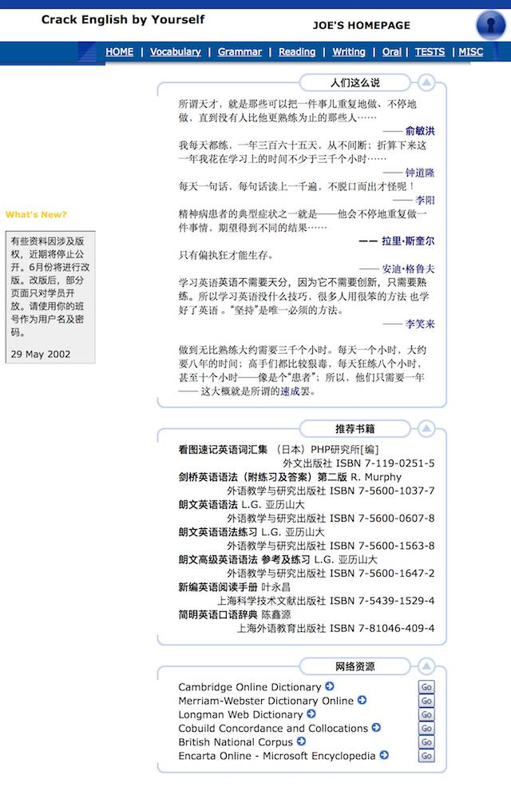
 
 2002 年的我，版权意识薄弱，甚至是错误的。那个时候的互联网上，什么都是免费的（十多年后回望过去，只不过是因为那时候互联网支付还没有现在这么发达，所以即便想收费也很难……），传播盗版好像是正义一样。（你看，我做过的蠢事……）
 
 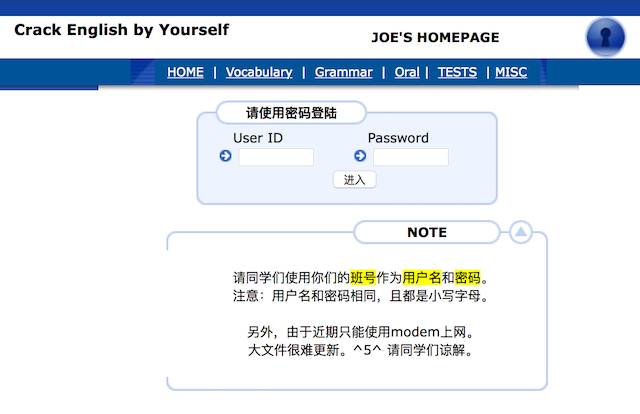
 
 我是个特别擅长给自己制造快乐的人。这里面的用户名和密码，其实随便输入什么都能进入…… 每期班结束的时候，告诉学生这事儿，大家都被逗死了。然后我会认真地告诉台下学生一个不变的真理：
 
 >**认真给自己找乐子的人没办法不招别人喜欢。** 
 
 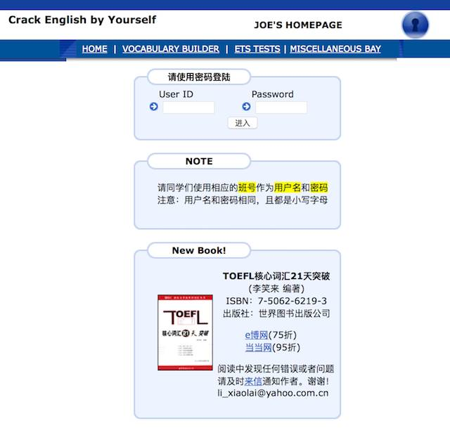
 
 转眼两年过去，到了 2003 年年底的时候，我终于有了一个属于自己的“产品”，我终于开始卖自己的东西，而不再是别人的东西……
 
 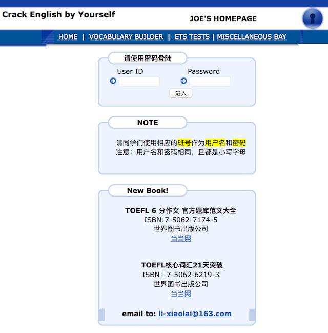
 
 2005 年，我有了第二个产品…… 睡后收入进一步增加。事实上是很大的增加，第二本书售价更贵，版税比例更高，更为关键的是，第二本书的版税我舍得全部花掉了……
 
 
 
 2005 年年底，父亲去世。我开始准备离开新东方。上面的截图是 2006 年 4 月份的时候，那时候我找外包做了一个网站，叫大了网，是一个 craglist 的 clone，很快不了了之，因为完全没有互联网创业经验，赶集网、百姓网、58 同城什么的迅速崛起（虽然后面它们也“熬”了很久），所以“互联网创业”干脆没我什么事儿罢……
 
 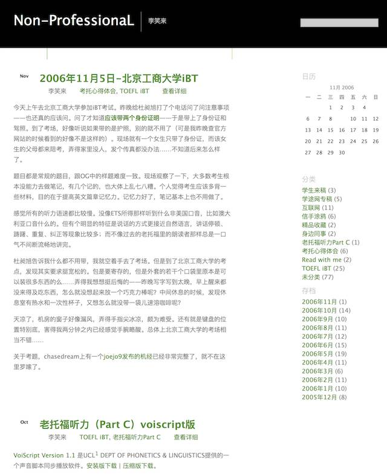
 
 2005 年年底我开始写博客，学着搭了个 Wordpress，虽然已经出过两本书，但事实上，现在回头看，“写好文章”这事儿，当时我差得还远着呢…… 翻看那时的文章，功力肤浅。
 
 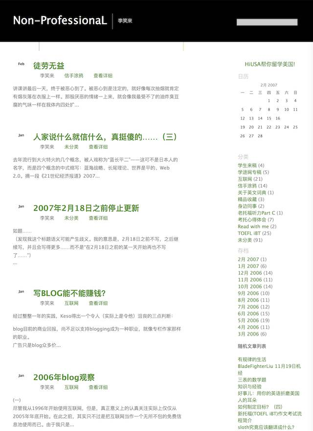
 
 2007 年年初，我已经递交辞职请求，那个春节的寒假，是我计划中的最后一期班。（当然，后来反复回去帮忙，2009 年春节，我还讲过一期班，那次的教室就在现在的“创业大街”上，多年后去车库咖啡的时候，看到对面的那栋楼，多少有点感慨……）
 
 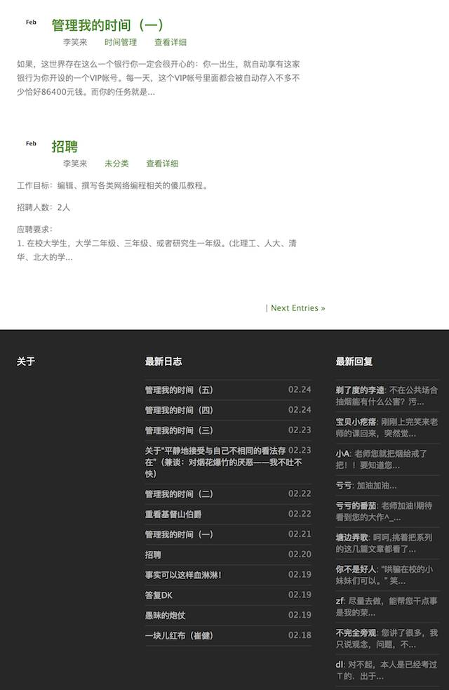
 
 这是 2007 年 2 月份，寒假班结束，我开始写《管理我的时间》—— 就是后来的《把时间当作朋友》…… 这个名称的改变，体现了一个有趣的过程：在写作过程中幡然醒悟。所以，写作常常是给自己创造灵感的过程；而人们总以为要有灵感才能写作，大错啊！
 
 >**灵感更多的时候是创作过程中获得的，而不是创作的起点。[^2]** 
 
 
 
 右上角素描画效果的照片，是我那时候的样子，还不是板寸。在新东方的几年里，我闲着没事儿的时候去健身房，整个体态变成了另外一个样子。去新东方之前，我是个特别消瘦的人。老婆说，抱一抱，就感觉换了个老公。
 
 >**新鲜感其实完全是可以自己创造的麽！** 
 
 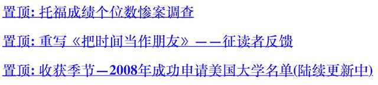
 
 转眼就是 2008 年了，《把时间当作朋友》为什么重写呢？因为我在远程更新服务器的数据库的时候，手一抖，出了错，整个数据库坏了，无法修复…… 文！稿！全！都！没！了！我咬了咬牙，决定凭记忆重新写一次…… 然后就真的三个月重写了出来…… 这是我跟很多人不一样的地方，关键时刻绝对不会掉链子。
 
 
 
 2009 年 8 月，《把时间当作朋友》印刷版上架销售。不过，这一页的截图里，值得一提的并不是这个，而是右上角的两个数字，四年的时间里，我写了 2,206 篇文章，13,735 条留言和评论 …… 我从来不删除任何评论，即便是那些前来辱骂我的评论。
 
**不删除评论是很重要的** ，先不说那些冠冕堂皇的话，比如， “你有表达的的自由，我有捍卫你表达的自由的权利”，只说说这对自己的用处：
 
 若是真能做到心平气和，那些反对你的和辱骂你的留言和评论，作用很多：
 
 > - 给你一些线索去理解那些人的思考方式；
 > - 偶尔你会发现自己的表达不清楚才招致误解；
 > - 还有些时候恰恰因为它们的存在而能确认自己确实是对的……
 
**绝对不删除任何评论** ，在那几年里给我带来了另外一个好处：性情真的淡定起来，开始变得很难生气或者难过。
 
 
 
 到了 2009 年下半年，《把时间当作朋友》的印刷版已经成了畅销书，半年加印 12 次…… 我的留学咨询公司也办得不错，我开始各种“不务正业”……
 
 
 
 2010 年 10 月，我在写《我也有话要说 —— 普通人的当众讲话技巧》…… 还在詹斌老师的奇遇花园办过讲座。这本书终究没有出版，[现在的完整电子版放在知笔墨上](http://t.cn/RU1Cwva)。
 
 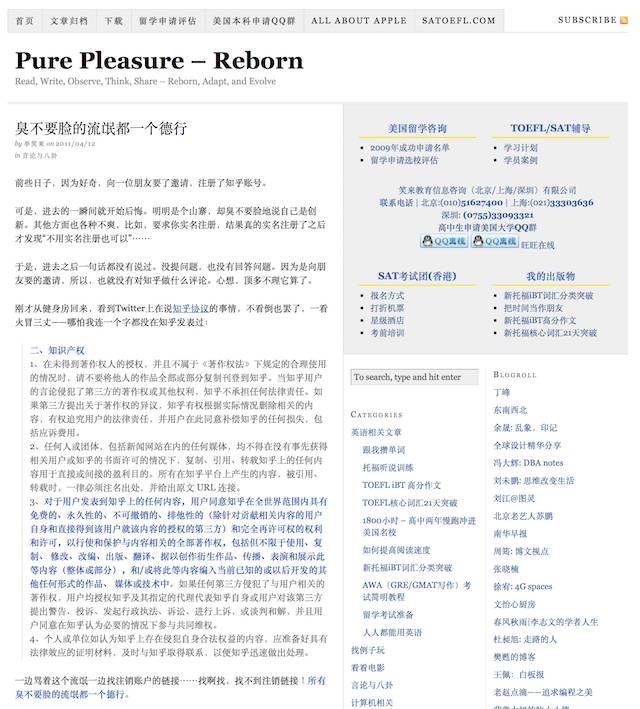
 
 2011 年初，正在研究比特币那会儿，中间专门写过一篇文章骂知乎，标题是《都不要脸的流氓都一个德行》…… 当然，后来我也转变了一些看法，再后来又认识了知乎的创始人；虽然这篇文章的内容至今我也不认为写错了，但这个过程其实让我对判断事物的方法论发生了很多次升级。2015 年 9 月底的时候，我写过一篇《[我如何看待知乎](http://t.cn/RGb8hPg)》，认真反思这事儿……
 
 
 
 2011 年 3 月份知道这世上还有个叫比特币的东西，等我觉得自己完全搞明白了，已经是接近 5 月底，这期间我已经买了 2100 个比特币，觉得“拥有一个虚拟国度的总资产的万分之一”是件特别牛屄的事儿…… 然后按捺住得意，写了那篇著名的《此物一出天下反》。
 
 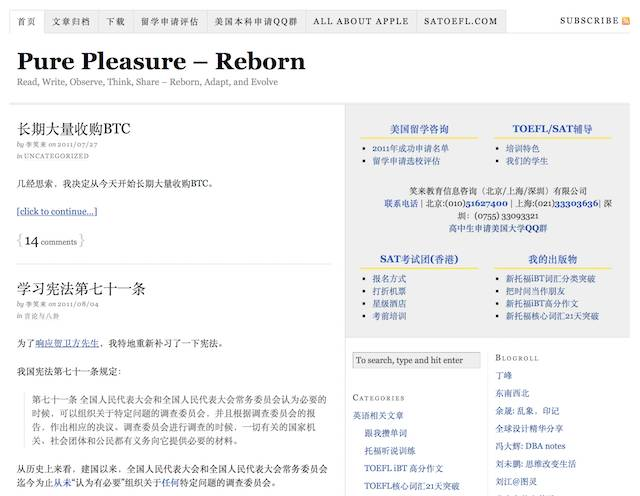
 
 到了 2011 年 7 月份，我那宏伟的挖矿计划惨败，具体原因就不说了罢。然后有天躺在床上发呆，突然坐起来，想起来九城的钱庚（网名布布）在张江的星巴克跟我聊天的时候说过，“金融的世界里当然是钱最厉害，所以，挖矿肯定不如直接卖币……” 我当时还赞同来着，怎么后来就好像完全不存在那段对话一样，把币卖掉了大部分去挖矿呢？！好蠢、好蠢、好蠢[^3]…… 然后此后的一年里，我大量买卖比特币，后来么，你懂的，那是多么愚蠢之后多么英明的决定。
 
 
 
 这是 2011 年 10 月份了，我终于妥协，开始购买付费 VPN……
 
 
 
 2012 年 9 月，我把博客搬到了 github 上，立志成为一个码农。本来想做在线教育，找了很多个外包，都无疾而终，一百多万花出去，屁都没搞出来。决定自己学。做出一定要自己学的决定的那一刹那，觉得自己真蠢，早就应该这样的啊，我怎么跟变了一个人似的，去找外包了呢？以为可以不学习的代价就是花出去一百多万，屁也没弄出来…… 带着悔恨，我终于成为一个码农。
 
 
 
 我真的去混 rubychina 社区，真的学，也真的学会了…… 真的认识了一票人，真的开始做东西了，最终，2013 年 1 月 19 日，我却没真的做在线教育，而是跟李路、沙昕哲搞了个 knewone.com …… 别说，还真挺火！
 
 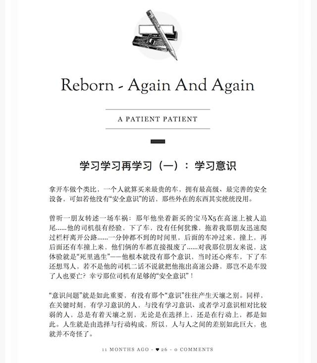
 
 2015 年年初，我没事儿干，因为从 2014 年年底开始，我已经停掉了所有的投资活动，等经济危机的到来[^4]。于是又捡起来自己过去一直想写的东西《学习学习再学习》，想到哪儿写到哪儿…… 后来又中断了。
 
 2015 年 8 月中旬，我决定开通微信公共帐号，然后接着在那里写《学习学习再学习》，然后又发生了很多事情 ……
 
 啰嗦这么多，倒是有件事儿可以因此说清楚了：
 
 >**我今天的写作能力也是通过很长很长时间才磨炼出来的。** 
 
 我自己翻翻 2006 年的文章，有时候会乐出来，读起来好费劲、写得很青涩；十年后的今天，我写文章几乎成了另外一个样子，但回头看的时候，进步真的很慢，所幸的只不过是每天都有一点进步 —— 而后享受到了[复利效应](A01.md)而已。
 
 
 [^1]: 这个域名现在已经不属于我了。原因也挺奇葩的，当年我在广州本地注册这个域名的服务商不见了，他们的网站现在已经打不开了……
 [^2]: [前言](README.md)里也提到过这事儿：单独一个灵感算个屁。
 [^3]: 做了蠢事敢于说出来，是因为现在说出来已经无所谓了……
 [^4]: 有个关于数字“7”的传说，后面会提到……