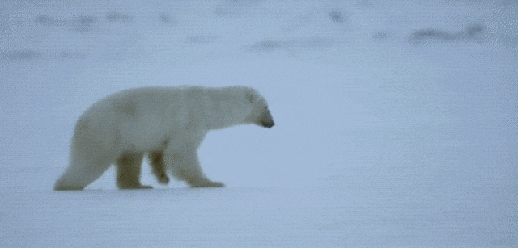

# 类比及其方法论
 
 [上一节](A08.md)提到的类比（我们必须持续自主升级自己的“操作系统”），是《新生》中最重要的类比。所以在这里我们也确实有必要认真研究一**类比**这个概念本身，也顺便整理一下使用**类比** 的方法论。
 
 一般来说，类比是我们在说明或理解时所使用的思维辅助工具，它的使用过程大抵如下：
 
 > 为了向对方解释清楚未知的 X …… （或者为了理解尚处于未知的 X……）
 > 去找一个与 X 类似的、但是对方肯定已经理解的 A
 > 说清楚它们之间的关系：X ≈ A
 > 把 A (或 A 与 X 相似的地方) 解释清楚……
 > 于是 X 不言自明……
 
 在课堂上，在教科书里，经典的类比有助于学生瞬间理解原本很难理解的知识。
 
 > 小学教师用煮熟的鸡蛋类比地球的构造，使得小学生一下子理解了他们不可能亲自体验的知识——谁有能力劈开地球看看呢？中学教师用太阳系的构造类比原子的内部构造，使得中学生一下子理解了他们不可能亲自体验的知识——在相当长的一段时间里，不是每个学校都能拥有足以观察原子内部构造的场离子显微镜的。更为神奇的是，中学生对这一知识的理解依赖于一个无法通过个体体验来获得的经验知识——太阳系的构造。[^1]
 
 可是，很少有人注意到，其实“经典类比”的数量极其有限； 因为好的喻体实在难找，既要足够相似，又要对方已知，不仅如此，还需要创造者刻意留心寻找 —— 同时满足三个要求的概率当然远远低于只需要满足其中一个条件的概率…… 创造恰当甚至精妙的类比，绝对是一种超强的能力，也是超强能力的一种表现。
 
 好的类比少到什么程度呢？遇到好的类比，人们都会不由自主地“收藏” —— 真的是物以稀为贵。我就是这样的，长期以来，我早就养成了收集创造各种精妙类比的习惯。这么多年来，我最喜欢的类比之一是这个：
 
 > 教育就像一副眼镜。
 
 > 戴上眼镜之前和之后，我们看到的其实是同样的世界；但带上眼镜之后，我们就能看得更清楚。
 
 > 教育也一样，受教育之前与之后，我们身处的其实是同样的世界；可受教育之后，我们就能看得更清楚，想得更明白，选择得更有效，行动起来更有收获……
 
 还有另外一个我特别喜欢的：
 
 > 科学确实是由信息构成的，正如房子是用砖头盖的一样。可问题在于，正如仅仅一堆砖头放在那里的时候我们不能称其为房子一样，一堆信息放在一块儿就叫科学，有点不像话……
 
 反过来，留心观察一下，你就会发现聪明人都更擅长使用类比 —— 因为创造类比本身就是难度很高的活动，一般人做不来：
 
 > - 首先要有足够的知识、信息储备，才能在理解新事物的时候找到真正合适的、最恰当的那个“参照物”；
 > - 之所以能找到最恰当的，不仅仅是找到最“像”的那个，还要仔细搞清楚“不像”的地方究竟有哪些，以免在传递信息的时候出现偏差……
 
 于是，创造一个“精妙的类比”是很非常复杂的过程，所花费的精力不知要比听者理解所需要的精力多不知道多少倍…… 极为恰当的类比，常常只不过是“妙手偶得之”，而想要再找一个“旗鼓相当”的就几乎不可能了。
 
 
 所以，能用精妙的类比的人，比那些能理解精妙类比的人可能要“聪明”许多；而连精妙类比都理解不了的人，就相对“笨”很多[^2]……
 
 2015 年年初的时候，我把 YC 创业课（CS183B) 反复看了很多遍，很精彩的课程，很强大的分享。有个好玩的现象就是，其中[几乎所有的讲者都格外擅长类比](http://zhibimo.com/read/xiaolai/growth/why-they-are-deft-at-making-analogies.html)。
 
 > 第三课里，Paul用了很多类比和隐喻，其中令人印象深刻的很多：
 
 >> (Customers) They're like sharks, sharks are too stupid to fool, you can't wave a red flag and fool it, it's like meat or no meat. 
 用户就像鲨鱼，鲨鱼太笨了——乃至于你根本忽悠不了它，你就不能对着它挥舞红布（做斗牛士的动作），对鲨鱼来说，只有有肉吃和没肉吃的区别……
 
 > 第五课里，Peter Thiel：
 
 >> ... all happy families are alike and all unhappy families are unhappy in their own special way, is not true in business, where I think all happy companies are different because they're doing something very unique. All unhappy companies are alike because they failed to escape the essential sameness in competition. 
 （这是个反向类比——即，你别以为它们一样，其实它们刚好相反……）
 ……据说，幸福婚姻都是一样的，不幸的婚姻各有各自的不幸；在商业世界里不是这样的，我倒是认为所有的幸福公司都是不一样的，因为他们都在做不同的事情。而所有不行的公司倒是一样的，因为他们都没能脱离竞争的相同窘境。
 
 > 第七课里，Kevin Hale把新用户比作约会对象，把老用户比作婚姻伴侣；第九课里，Marc Andreessen把有限的投资能力比作一张打不了几个洞的卡片…… 第十四课里，Keith Rabois使用了超级多的类比和隐喻：
 
 >> So basically what you are doing when building a company is building an engine.
 >> 打造一家公司，就像打造一个引擎……
 
 >Keith Rabois还用“编辑”（Editing）这个暗喻去形容所谓的管理：
 
 >> So one of the most important things I learned at Square is the concept of editing. And this is the best metaphor I have ever seen in 14 years of running stuff, of how to think about your job.
 >> 所以我在 Square 学到的最重要事情之一就是“编辑”的概念 —— 这是过去我在管理员工的 14 年经历中所遇到的关于如何看待（管理者）工作的最好隐喻（类比）。
 
 把类比当作用来辅助理解的手段的时候，要关注“像”的地方 —— 这是重点；而不是“不像”的地方 —— 那不是重点[^3]。
 
 这就好像当老师正在课堂上讲地球构造的时候，有学生喊，“老师！地球和鸡蛋一点都不像！要是地壳像鸡蛋壳那么容易碎，我们就全完蛋了……” —— 这干脆是在淘气，甚至是捣乱。小朋友这样干还很可爱，成年人还分不清主次就有点不妥了。
 
 还有个需要特别注意、甚至应该刻意牢记的是：
 
 > * 类比的逻辑重点是“像”而不是“是”；
 > * “≈” 并非 “=” 或者 “≡”；
 
 大多数听者缺乏这方面的刻意训练，骨子里他们忽视“约等于”与“等于”之间的区别，他们的逻辑因含混而自觉非常自然 —— 他们的想法可以这样表述：
 
 > 是啊，我知道约等于不等于等于，但约等于确实约等于等于么……
 
 真是个自然到难以反驳的逻辑！
 
 不小心混淆了“像”与“是”的人，在用类比理解新事物的时候，接着下一步要犯的错误就是“以偏概全” —— 因为新事物已经等同于（是）旧事物了，那就没什么需要“理解”的了嘛！更没有了继续研究得必要……
 
 既然类比是个辅助理解、辅助说明的工具，那么使用它只是探索中的一个过程，不是结果。理解了那“像”的部分之后，还要继续探究那些“不像”的部分，新事物之所以新，就是因为那些“不像”旧事物的部分啊！
 
 这是个特别细微巧妙的陷阱 —— 很多人始终并未察觉**在面对新事物的时候，我总是告诫自己，暂时先克制寻找类比的冲动** ，因为不恰当的类比还不如没有类比，甚至，不恰当的类比干脆相当于有毒，会麻醉我们的大脑，阻止我们有效地思考。
 
 我总觉得**在对新事物有了足够的了解之后再去找类比不迟** ；而对新事物有足够的了解，也是有能力找到精妙类比的前提，万一找到了，可以自己用来辅助面向他人的说明，或者作为帮助他人的辅助理解工具…… 找不到很好的类比，也很正常。
 
**好的、精妙的类比超级炫酷，可还是要小心为妙，因为类比真的影响思维。** 
 
 比如，好像人们都喜欢用“登山”去比喻成功的路径，也许“攀登”这个词本身就给人“进取”的印象罢。
 
 
 
 可是长期以来，我觉得我所遇到的所有成功与突破，都更像是破冰。我总觉得自己站在一个冰原之上，特别想要把脚下的冰砸开……
 
 
 
 可无论是我使劲跺脚也好，满地打滚也罢，我总是没办法一下子成功，一下子突破。若非换个视角，或者谁给我个透视镜，我真不知道那冰实在是太厚了……
 
 
 
 往往是就好像我在冰原上四处游荡，四处猛砸，猛凿，有时深，有时浅，有时候甚至可以从冰缝或者冰洞里看到冰下的水，可那冰就是那么坚实，我死活都没办法破冰而入……
 
 还记得美剧越狱里主角是怎样运用胡克定律凿开那堵厚厚的、“坚不可摧”的墙的吗？
 
 
 
 终于破冰的那一瞬间，我的感觉就是，过往我砸过的、凿过冰缝、冰洞，终于以某种方式（几乎肯定是我之前完全不知道的方式）形成了一个三角，力学原理瞬间爆发，那冰一下子大面积破开…… 于是，我终于“入水”了。
 
 当年我费尽周折应聘进入新东方，对我个人来说，是个突破。小时候学了点编程原理得过大奖却没能够被保送进清华但终究有点计算机常识；读了完全不喜欢的会计专业却因此收获了最重要的知识：概率和统计；因为本专业并不精湛所以毕业之后只能去做销售却因此锻炼了演讲能力 —— 就是这三点使得我在突破之后成为最受欢迎的老师。突破是突破了，这样的结果，其实并不是“设计”，却也不完全是“偶然”。
 
 再后来的《把时间当作朋友》创作，对我个人来说也是一次突破。教写作不是我的计划与设计，只是教阅读的我听从领导安排去教大家不愿意教的课程 —— 没人愿意教写作课，都觉得费力不讨好。为了教好，自己就要学好，写好。前后写了大量的英文文章，反过来中文竟然写得比以前更清澈了，我自己也没想到。而最终提炼出“时间不可管理”，其实是在写作过程中闪现的“灵感” —— 这一点从我最初给那系列文章取的名字就看得出来：《管理我的时间》…… 在反复折腾中抵达了一个之前完全看不见、想不到的地方。
 
 创建 [Knewone](knewone.com)，收割大量的比特币，创建比特基金，参与若干个创业项目，甚至像是玩票一样的 Telegram 第三方客户端 [Dove](https://itunes.apple.com/us/app/dove-a-place-for-groups/id964457101?mt=8)…… 这些都是今天我正在做一个教育类社群的成因，但还是相同的类比：是破冰，而不是登山。哪怕在 2015 年的 10 月份，我还没有彻底明了我最终做出来的东西究竟是什么样的。整个破冰过程是 2015 年的 11 月才开始的，然后我就看到了另外一个之前完全无法想象的世界……
 
 把登山当作类比，与把破冰当作类比，有一点不一样的地方。把登山当作类比的时候，我们会不由自主地以为“突破”是看得到目标的事情 —— 因为山顶就在那里。把破冰当作类比的时候，我就很自然地不太在意那个可以看得见、想得到的目标，很理直气壮地明白：我要去的是一个现在完全看不到的地方，但肯定是不一样的世界。
 
 类比是影响思维的，既然它能影响思维，进而就能影响行动，而行动构成我们的生命。所以，类比在使用的时候不得不小心。寻找更为恰当，更为准确的类比，其实不是像很多人想当然的那样，“不就是个说法嘛？！” —— 因为说法根本不重要，重要的是说法、想法可能引发的是最重要的东西**行动** 。[^4]
 
**除此之外，类比也常常是产生“融会贯通”的手段。**  这里涉及到一个特别重要的学习技巧：
 
 >**学会任何一个概念、方法论之后，都要问自己：这个道理还能用在什么地方？** 
 
 这本质上来看，是一种反向类比应用。这种思考多了，会很自然地产生“穿透表象看到本质”的能力。之前提到的[“重力加速度”与“赚钱速度”之间的类比](A03.md)，就是这种思考模式的结果。
 
 

 [^1]: 摘自[《把时间当作朋友》第四章，第四节，经验局限](http://zhibimo.com/read/xiaolai/ba-shi-jian-dang-zuo-peng-you/Chapter4.md)。
 
 [^2]: 注意，这里说的聪明与笨，都是变量，不是恒量——我个人是相信每个人都有足够大的成长空间的，除非他自己放弃。）
 
 [^3]: 分清主次，是一种格外重要、却又常常不被重视的能力。
 
 [^4]: 后面还有一个影响行动的类比：《[苍蝇与蜜蜂]（A20.html》