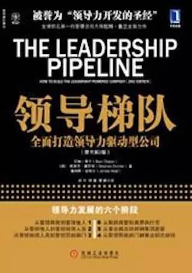

# 成为一个有战友的人
 
 很小的时候，大约十四五岁，有一天我父亲给我讲了个故事，然后问了我一个特别简单朴素直接的问题，他说：
 
 > 笑来啊，你现在认识的人也不少了，你说他们都是你的朋友。我问问你，如果万一哪一天你出事儿了，比如有人追杀你，他们当中哪一个是能冒着生命危险把你藏在他家地窖里坚决不交出去的？
 
 这个问题很严肃啊。这你又没办法当面直接问，“我要是出事儿了你会把我藏到你家地窖里打死也不交出去吗？” 这种问题问了也白问啊！所以我想了很多办法去观察、去判断、去思考……结果呢？结论是，那时我身边一个这样的朋友都没有……
 
 现在回头想，这个简单朴素直接的问题当然改变了我一生。
 
 这世上绝大多数人是没有战友的 —— 甚至他们连真正的朋友都没有。没有朋友的人，是不会幸福的，因为他与这个世界没有真实有效的连接，有了好东西，没地方去分享，也没有人跟他分享什么……进而，没有战友的人呢，是很难有所成就的，因为一切的追求，最终都是战斗啊！
 
 除了自身成长之外，我觉得“寻找战友”是一生中最重要的任务，因为我们都是有追求有梦想要去实现的人啊，我们都是为了追求和梦想必定要去战斗的人啊！
 
 在我看来，“全民创业”，必须有个前提，就是民众之中有足够多的人是有战斗力的，是战士；且这些人不是团伙，而是团队，他们之间是战友关系，而不是狐朋狗友，乌合之众。
 
 不能做朋友的人，是不可能成为战友的。所以，有潜力可以成为战友的人，和有潜力能作为朋友的人是一样的，需要起码三个特征：
 
 > - 一技之长
 > - 追求进步
 > - 真诚热情
 
 连一技之长都没有的人，是没有战斗力的，当“战斗”打响的时候，他们相当于手无寸铁，甚至手无缚鸡之力，无用之人。不追求进步的人，不学习的人，甚至舍不得钱买书的人，是不会有更强的战斗力的。不真诚的人，是不可能跟你同甘共苦的，又如何与你出生入死呢？
 
 有些人别说战友了，连朋友都做不得，尤其是那种“死要面子活受罪”的人。他们总是毫无主张（就是其实没脑子），遇事总是各种纠结（还是没脑子），要么唉声叹气地抱怨，要么无能地暴跳如雷（反正就是没脑子）……遇到这种人，一定要当机立断地断舍离，顶多偶尔为他们打开一个虚拟机，应付一下，但有一扇大门一定要直接关掉，让他们绝对没办法进入属于你的那个领域。
 
 为了能与那些有一技之长，还追求进步，并且真诚热情的人做朋友，你自己也必须是他们的同类，否则他们是不会跟你做朋友的，对他们来说，直接对你断舍离，不才是最划算的吗？
 
 朋友不会自动变为战友。要满足以下几个条件或者经过以下几个阶段，朋友才可能转变成战友：
 
 > - 共同目标
 > - 并肩战斗
 > - 共享成果
 
 找到共同的目标，并且经过沟通，确立共同的目标，这很重要 —— 否则没有战斗，就算有也是各自的战斗。有了共同的目标，才有并肩战斗，才有同甘共苦，才有荣辱与共，才有出生入死，才有共进退……没有共同目标的，不是战友，是狐朋狗友，不是团队，是团伙。
 
 所谓战斗力，长期来看，是脑力，而不是体力，核心是学习能力。要先把自己变成战士，然后才有资格寻找到其他的战士，找到共同目标之后，成为战友，然后共同浴血奋战，达成成就。看看历史书吧，有一个生死战友，就很厉害了，陈胜、吴广，各自只有一个真正的生死战友；有两个生死战友，就可以桃园三结义了……创个业什么的，根本不是什么事儿罢？
 
 所谓的领导力，其实就是带着战友战斗，然后自己成长，也帮助他们成长，帮助战友再找到战友……两三个层级下来，就形成了一个真正的团队。
 
 很多人，心血来潮，就想去创业，脑子一热，然后就振臂一呼……结果呢？无人相应，身边空空荡荡，脑子嗡嗡作响……（借用李宗盛的歌词）
 
 大多数社交是无效的，只因为大多数人不明白，那样得来的，常常既不是朋友也不是战友 —— 人和人的差别就是这么简单，却也就是那么巨大。
 
 这是很朴素的道理。我觉得很多家庭在这方面的意识完全是零，甚至家庭成员之间连朋友都算不上，所以才家庭不幸福，所以才家庭无成长、无成就，所以才最终支离破碎……
 
 有一本书，The Leadership Pipeline，中译本叫《领导梯队》，是《新生》社群成员必读的书籍。
 
 
 
 注意，不仅仅是“推荐”，而是“必读”。我写的《新生》只是一个起点，让大家变成一个起码有一技之长，追求进步，真诚热情的人，一个值得被交往的朋友；而后，在成长的路上，每个人都应该进一步变成战士，成为一个真正有战斗力的人，甚至应该找到战友，还要进一步成为战友们的领导……有能力创建团队，为了目标共同战斗，荣辱与共，实现追求，达成理想。
 
 这本书的中译版在豆瓣上有电子版可看，才 9.99 元人民币。
 http://book.douban.com/subject/6536593/
 
 英文原版在 Kindle 上可购买电子版，15.67 美元。
 http://amzn.to/1NXleqV
 
 真正有用的书，一本就可能完全改变生活，这就是一本这样的书 —— 尽管在很多人眼里看起来并不像……