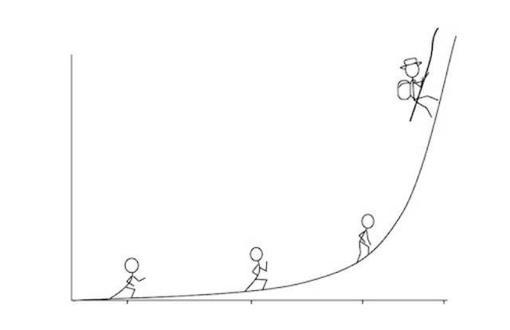

# 如何真正消化一本书？
 
 书大抵上分为两种：虚构类（Fiction），非虚构类（Non-Fiction）。读非虚构类的书籍，是为了获取新知识，并应用到生活中，让自己获得进步；就我个人而言，我更喜欢看非虚构类的书籍，从中获得的愉悦，感觉更大，因为那种愉悦通常有更为坚实的支撑 —— 进步。而虚构类的书籍，在大学毕业之后已经很少读了，可能是因为我自己在那里很难体会到太多的乐趣，更可能的另外一个原因是我已经彻底把获取那种愉悦的途径转移到了影视作品上。
 
### （一）
 
 我读书很快，也因此读得很多，但我从来不强调自己的阅读速度 —— 甚至，我坚持认为 [“阅读速度”是个没用的概念](A10.md)，在我眼里，只有“理解速度”，理解速度快，才能有效提高阅读量。
 
 曾经有一段时间，我阅读英文书籍的时候，干脆是在电脑上用键盘敲，边敲边读…… 因为那个时候我发现自己的理解速度甚至跟不上手指头敲键盘的速度。别说遇到生词需要去查了，甚至常常出现的情况是，手指已经将一句话敲完了，却发现自己的脑子竟然不能理解这句话的确切意思……
 
 没多久，理解速度开始提高，我也没啥兴趣拿着一本书“一目十行”地读。遇到好书，我会抽时间朗读完，一本二十万字左右的书朗读完，也不过十几个小时，中间断断续续，也能一个星期内搞定。更多的时候，时间花在那些需要停下来认真思考的部分，需要停下来心平气和地开开脑洞的部分，需要反复搜索寻找更多资料与关联的部分……反正，眼球快速移动本身，没有任何意义。
 
 >**阅读，是为了理解，而理解这事儿，慢，即是快；快，便是无。** 
 
### （二）
 
**大多数情况下，我的阅读并没有功利性。完整性阅读，是没办法有功利性的，因为其实完全没办法知道所读、所学的东西究竟什么时候才能真正发挥它的核能量。**  还有另外一层原因是，还没读完（输入），还没消化完（处理），当然也完全没有开始行动（实践），所以，别说发挥核能量了，连发挥一点能量的可能性都很少。
 
 另外一种阅读，我称之为检索性阅读。这种阅读本身就是功利性的，比如为了支持某个论点去搜索更为精彩、更为经典的事例；又比如为了思考得更为全面，去翻翻不同属性的人群是如何看待某个问题的；再比如，为了以上同样的目的去检索自己已读过的书库……
 
 我总觉得阅读是构成自己生命的最重要组成部分之一，所以当然很舍不得降低它的质量。在信息泛滥的时代里（注意，不是知识泛滥），有个小技巧特别管用：**标题党的文章直接不看了——说实话，即便错过什么了，也没什么可惜。**  这个小技巧真的不知道帮我节约了多少时间，提高了多少生活质量。
 
 我从来都懒得接受“碎片化xx”之类的概念，比如，碎片化阅读，碎片化思考，碎片化时间什么的，谁爱碎谁自己碎去，我才不想要一个碎片化的生活呢。
 
 信息这东西，必须系统才有价值。碎片化的信息也许有用，但就算完全忽略，也不至于致命。舍了就舍了，没啥。这种勇气其实不少人都有，巴菲特就是其中之一。害怕错过什么，是一种情绪，来自于空虚的情绪：因为什么都没有，所以就渴望有一点什么，所以就特别害怕错过任何机会。充实的人，是不怕错过什么的，因为已经充实，错过点什么，真的无所谓，机会有的是，错过一大把又如何，反正因为充实而能够相信自己确实有实力终归抓到至少一个适合自己的机会。
 
 所以，一定要读书，而不是把本来只不过是获得知识的辅助手段而已的杂志、文摘、新闻等等当做唯一主要手段。买好书，读好书，读懂好书，然后用知识改变自己的生活。
 
### （三）
 
**别人是不可能帮你吃饭的。同样的道理，别人其实是完全没办法帮你读书的。**  虽然我们在学校的时候，总是习惯了由老师带着、逼着读完整本书。
 
 我一直觉得现在的学校其实是一种特别诡异的存在：一个学期好几个月，好几个老师就带着学生们完整地读完那么几本书，然后有些老师其实还讲不明白，大部分学生还学不明白…… 于是，生命就那么被浪费了。
 
 从另外一个角度望过去，这几乎是在刻意把学生们变傻、变笨。这是在潜移默化地告诉学生们，“这东西好难的！难到什么地步呢？难到一届又一届的学生，都要花很长时间学，然后大部分还学不会、学不好呢！”
 
 最要命的还不是拉长原本可以很短的理解时间，而是让学生们学啊学啊学啊学，就不让学生们用！这是什么道理？你看多少人，小学六年，初中三年，高中三年，大学本科四年，加起来都十六年了，学了十六年英语，然后竟然从来没用过……
 
 
 
 这是我 2011 年 5 月份在上海的 TEDX 的讲演视频 —— 那时候的我，在讲演的时候还刻意使用很多技巧呢，不过，时至今日，我已经完全不用任何技巧了。（补充一句，那年幻灯片中提到的何骞同学还很嫩，所以在这个视频中被“黑”了，可几年后的今天，他已经是博士毕业，目前在 FitBit 工作……）
 
 说来说去，总结起来就是：别被他们骗了，你本来没那么傻……
 
### （四）
 
**拿来一本书，就好像要打一场仗，打仗之前最好先考察一下地形吧？**  同样的道理，拿来一本书，不应该是抓起来就从第一个字开始读起，一直读到最后……应该先看看目录，再看看附录，仔细读读前言，也不妨在网上先扫扫书评……要先大致对这本书有个了解，然后再开始行动比较好。
 
 不同的作者有不同的组织方式，但大体上都是差不多的。总是要分章节。每一章其实都是在着重讲解一个概念，它的应用，它的方法论。而陆续的章节，通常是必须理解上一个概念之后才能进一步理解的概念，及其应用与方法论。所以，一头扎入内容之前，最好把这些概念大致过一遍，不理解没关系，哪怕先记住那些概念的名字和先后关系都很有帮助。
 
**在读的过程中，不断整理这些概念与方法论之间的关系，其实是“消化”的必要过程。**  有些人从小就学会了并且早就习惯这么做，而大多数人一辈子不会这么干 —— 这就是为什么最终绝大多数人只具备读半本杂志，看个豆腐块文章的能力，而不大可能真正独立消化一整本书的根本原因。
 
### （五）
 
**在阅读的过程中，要不断向后总结，向前预期 —— 这是最基本的理解技巧。**  在阅读的过程中，要不断总结刚才输入的东西都有什么，它们之间是什么样的关系；与此同时，还要不断预期下一步的内容是什么……这是一个不断循环的输入处理的过程。很多人懂得向后总结，却不懂得也应该同时不断向前预期，于是他们只有输入与处理这两个部分。当然绝大多数人除了输入之外什么都没有，连处理都没有。最终只有少数人的阅读理解过程是不断循环地“输入、处理、输出”的过程，尽管这里的“输出”某种意义上不过是“伪输出”……
 
 向前预期，常常相当于为“跳读、略读”提供一个安全机制。读着读着，发现作者提出了一个自己已经深入了解过的论点，再往下扫一眼，发现论据也是自己之前了解的，那这一部分就可以安全地跳过了。又由于一直保持着一个预期，再往下读的时候，发现“嗯？怎么回事儿？跟我想的不一样呢？”那就要折回去认真找原因……反之，要是一样，说明自己的跨越是正确的么。
 
 所以说，在良好的阅读习惯下，理解速度会不断积累，最终不断加快 —— 因为所有的知识都有共同点：它们不一定能用在哪里，它们早晚必然融会贯通。所以，理解过的东西越多，理解新的东西就越快。说穿了，理解能力差，无非就是见识少，仅此而已。
 
### （六）
 
 一旦遇到需要分享“如何读书”的场合，我总是会提起这句话：
 
 >**我有一个奇怪的本领：就是，把一本书拿过来，我即便读不懂，我也能读得完。** 
 
 这句话总是引来哄堂大笑，可实际上，首先我是认真的；其次，却也更为重要的是，觉得这事儿荒谬恰恰是大多数人其实不懂如何读书的表现。
 
 读不懂怎么办？没关系，只有一个办法靠谱：硬着头皮读完，然后反复读很多遍。这是一个特别重要的本领，很多人不知道。其实，重要的知识，从来都是通过反复学习才能获得的。一下就能学会得东西，通常上价值不大。
 
 有一点弄不明白就放弃，那能学会什么呢？
 
 还有一个常见现象：有些书籍就是难懂，因为它的内容结构并不完全线性，也就是说，第二章的内容需要第五章的知识才能理解彻底…… 所以，最终，只有我们这种不怕暂时读不懂，能硬着头皮读完，然后再反复来过的人才能消化这种书籍。
 
### （七）
 
**一定要用起来。**  很多有用的东西，之所以最终没用，是因为压根没用过。知识无用，这是二货思维，所有的知识都是有用的，哪怕巫术都有用，更何况知识。可是不用的东西，没用起来的东西，还不如虚无 —— 因为读过、学过，时间与精力已经耗费了，这可是最宝贵的不可逆不可回收不可再生资源！
 
 2000 年，我突击考了 TOEFL、GRE，就跑去新东方应聘出国留学培训教师职位；2005 年开始前后写了两年多，终于觉得自己能用文字讲明白道理了，就写了《把时间当作朋友》；2012 年我学了 Ruby On Rails，就和李路和沙欣哲一起搞出来了一个 Knewone；2014 年我学会了使用 Sketch，就用它设计了若干个 APP 的原型，顺带逼着几个程序员也变成了设计师；2015 年上半年，我读了许多本关于社区建设的书（其中包括那本著名的 [The Art of Community: Building the New Age of Participation](http://www.artofcommunityonline.org)），你看我正在打造社群…… 不仅如此，我还帮很多人打造社群。
 
 不用，学它干嘛？这与我读书的原则也是相通的：不用认真读的书，读它干嘛？这与我对生活的态度也是一样的，既然活着，就要活好，活得精彩。
 
### （八）
 
 暂时用不起来怎么办？教！我总是重复这句话：
 
 >**教是最好的学习方法。** 
 
 把你学到的，总结好的，琢磨清楚的那些知识（不是胡说八道的那些东西）传递出去，分享给你身边的人。“教”，不一定非要像老师一样在课堂上给一帮学生讲（还不允许他们打断）……“教”可以有很多种形式，比如，“分享”，就是“教”的一种形式。在饭桌上都可以进行：
 
 “我最近读到一个新的概念，特震撼：三度影响力…… 原来肥胖症居然在某种程度上是可以传染的！”
 
 如果你的朋友对此感兴趣，那你就要再仔细一点说明其机理，其作用，甚至用更多的来自自己身边的例子去讲解。在一来二去的交谈中，你会发现自己也还有很多没弄明白的地方，还有很多地方需要更准确的陈述，需要更精彩、更令人信服、惊叹的论据…… 怎么办？回来改进呗，下次在另外一个饭桌上再演练一次……
 
 所以，我也总是分享这个道理：
 
 >**分享，不仅需要能力支撑，也是培养能力的最重要手段。知识分享，没有成本，只有收益 —— 双方都有的收益。** 
 
 分享的技巧很简单：
 
 > 1. 真诚，只分享自己确实觉得好的东西；
 > 2. 也是真诚，绝对不能居高临下地装蛋；
 > 3. 还是真诚，对方完全有可能不理解你。
 
### （九）
 
 还没完！别忘了问自己这个最重要的问题：
 
 >**这个概念、这个方法论、这个道理、这个知识，还可以用在什么地方？** 
 
 这是让你真正培养融会贯通能力的方式。所谓的聪明就是这么来的：脑子里有足够多清晰正确的概念与方法论，然后它们之间还有正确应有的关联…… 所以聪明的操作系统总是有更多的想法、更多的方案、更多的可能性。
 
 万一想到了可以“出其不意”地使用的场景，那就赚大了，因为同样的东西到了你的手里却发挥了不一样的作用，你当然与众不同，也只能与众不同。
 
### （十）
 
**与喜欢学习的人泡在一起**  —— 这一点真的特别重要。潜移默化的力量是非常大的，与喜欢学习的人在一起，正面的影响力很大；与不喜欢学习的人在一起，负面的影响力不仅很大也很可怕。
 
 寻找那些终生学习的人，把他们当作朋友，把他们当作榜样。
 
 网络时代有个好处，这种人虽然身边并不多见，但网络上却很常见。为什么呢？网络消灭了地域的限制，甚至消灭了语言的限制。我就有个很长期的榜样：Bruce Eckel。我根本不认识他，也没有过任何传统意义上的交往，连 email 往来都没有。他是 Thinking In C++ 的作者。十多年前，他在网上发布 Thinking In C++ 第一版的写作计划，然后以极快的速度更新完成…… 毫无疑问，见识到有人这样，就成了后来我写书的时候“雷厉风行”的根本原因和动力。再反过来说，人家写书都可以这样，我们读书怎么可以拖拖拉拉呢？
 
 

 
# 别人一年都读多少本书呢？
 
 这不太好统计，但美国人有相对好的统计数据，看看他们吧。随便在网上搜了一下，挑了个比较靠谱的出处。以下调查结果来自于 [Pew Research Center](http://t.cn/8sLXwr0)：
 
 > Among all American adults, the average (mean) number of books read or listened to in the past year (2013) is 12 and the median (midpoint) number is 5 –– in other words, half of adults read more than 5 books and half read fewer.
 
 这个调查结果是，美国成年人平均来看大约一年读 12 本书。
 
 首先要明白，调查这事儿，常常并不完全靠谱，很难知道那些填写调查表单的人是否说的是真话。不能排除有些人不好意思写太少，随便就在真实数字前面加上一个“1”的情况……
 
 也肯定有很多人一年到头也没读过一本书，这些人会把平均值拉下来很大一个幅度 —— 因为大量阅读的人在哪儿都是少数。
 
 又搜索了一下，发现同年度，YouGov/Huffington Post 搞过[另外一个调查](http://t.cn/R48jmSA&nbsp)，结果大抵是这样：
 
 > The results show that a quarter of Americans haven't read anything in the past year but that most people have read at least one book and less than fifty books over that time. The margin of error is 3.5%. 
 
 具体结果是，28% 的人（大约 1/4 多一点）过去的一年中，根本就没有读过任何一本书。
 
 随便推算一下罢。
 
 > - 如果总体上平均每人每年读书是 12 本；
 > - 其中有 28% 的人一本都没有读过；
 > - 那么剩下的 72% 的人实际上每人每年平均读书是 16 本左右；
 > - 而这 16 本又是平均值，所以，大约有 36% 的人每年读书 16 本以上……
 
 也就是说，如果你是在美国生活的成年人，一年要读 16 本书以上，才勉强算是上中下三等中的第一等。
 
 另外，在上述第二个调查中，大约（只）有 8 % 的人表示自己过去的一年中读过的书超过 50 本。
 
 这里并不排除有些人过去的一年里读了 50 本小说（虚构类，Fiction），而不是知识类（非虚构类，Non-Fiction）。也同样不能排除有一些人并没有说实话…
 
 > 其实吧，真正好的小说能传递的知识也非常的多，只不过真正优秀的小说其实很少而已。
 
 一般来说，大量阅读非虚构类知识性书籍的人，阅读数量会比普通人大出好几个量级，因为他们除了研读之外，还有另外一种阅读： 检索性阅读，就是为了检索某个理论或者实例甚至只是为了获取一个数字而去快速浏览…… 所以，这些人除了大量研读书籍（还不包括必读的一些论文、杂志文章）之外，还读过大量扫过一眼或者扫了一遍，做过摘要的书籍。
 
 所以，人群中的阅读量分布，大抵上应该是这样一个曲线：
 
 
 
 看着很眼熟，是不是？其实跟 [复利曲线](A01.md)一个样子啊！
 
 
 
 若是把年平均阅读，换成“一生平均阅读”，那条曲线可能变成这个样子，嗯，你之前见过的那个曲线，**人与人之间差的岂止 10 倍，100 倍都很正常**  ：
 
 
 
 普遍来看，过了一定岁数之后，大多数人渐渐失去了阅读的欲望，最多读个报纸、看看八卦，用阅读作为消遣而已。就连大学里的教授们，相当数量都是拿到一定职称之后就懒得继续了……
 
 我有一位朋友，愉悦资本的戴汨（微信公共账号是 ThinkingSlow），说他的理想是一生认真阅读 1500 本书。他用的措辞很认真，没说是“阅读”，而是“认真阅读” —— 这是耗费好几倍以上时间的决定。他不是说说而已，是真的无论多忙都必须读书，否则就很难过。每次与他约饭，除了谈书之外，沉默的时间居多。仅这一点，我就很尊重他。
 
 其实，**阅读量还受另外一个重要因素局限，就是语种。**  如果市场上没有那么多好书可读，人们的阅读量自然会下降很多。所以，可以乱猜：美国人的阅读量应该远远大于越南人的阅读量…… 意大利人的阅读量可不小，虽然意大利语相对英语来看算是“小一点的语种”，为什么呢？因为意大利人大多数都是自然的双语甚至三语使用者。
 
**在哪儿都一样，真正尊重知识的人就是少数，古今中外都一样。**  对于那些真正渴望知识，尊重知识的人来说，不让他读书是最大的惩罚。而对于另外一种人来说，书完全不是必需品。
 
**每个月至少读一本好书，是那些关注自我成长的人的最低要求。**  这个要求其实并不低，因为要读的是“好书”，而不是随便哪本书；必须是那种读过之后能给自己带来改变的书 —— 又因为要靠践行来判断是否学到，所以阅读成本其实非常高，所以才更珍惜。
 
 

 
**有一本书** ， [The Leadership Pipeline](http://mp.weixin.qq.com/s?__biz=MzAxNzI4MTMwMw==&mid=401552083&idx=1&sn=8480a814d04925b9dda83cb1083734de&scene=21#wechat_redirect)，中译本叫《领导梯队》， **是《七年就是一辈子》社群成员必读的书籍。** 
 
 