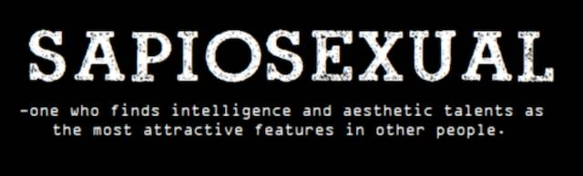
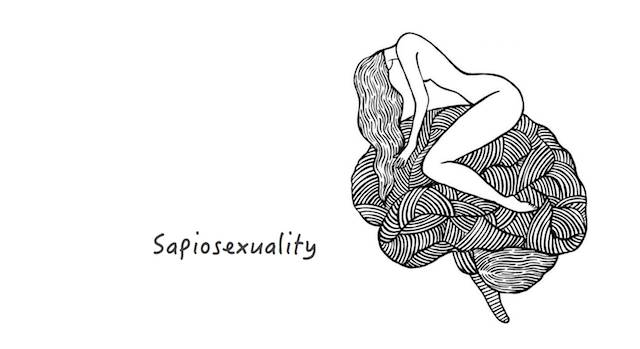
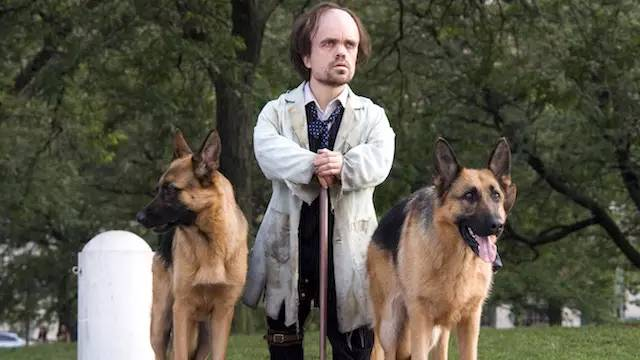
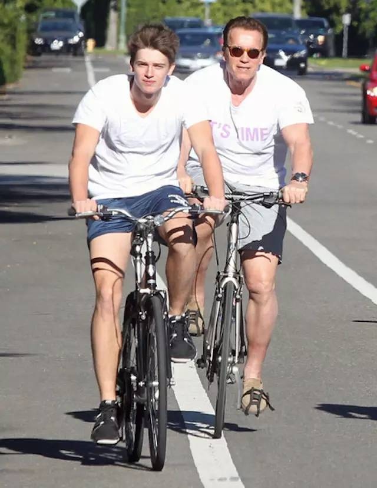

# 为啥人丑就要多读书？
 
 呵呵，**人不丑就可以不多读书吗？** 
 
 人们总是有很多幻觉，或者一厢情愿。
 
 > 比如，长得不够帅的男生以为（其实是希望）长得帅的就不可能聪明；长得不够漂亮的女生认为（甚至是盼望）长得漂亮的根本不会做家务；再比如，自己不够富就指望富二代都是败家子……
 
 有幻觉的人真心不知道自己有幻觉，一厢情愿的人真心不知道他们正在忽视自己其实司空见惯的事实 —— 因为现实真的常常令人绝望。
 
 当年还在新东方的时候，有位同事去耶鲁读 MBA，回来之后跟朋友喝酒，喝着喝着哭了，说：
 
 > 有些人会让你绝望的。我那个室友…… 那是真的帅，关键吧人家还那么聪明，气人的是吧人家还那么勤奋，无奈的是吧人家本来就贵族出身，你知道什么让人绝望吗？一路结交下来，最终发现人家人品都比你好，你说，这你能不绝望吗？！
 
 其实，**这世界这样的人很多**  —— 只不过平日里根本见不到，他们就好像活在另外一个世界里一样。前两天大家开玩笑说的那个“被美国政府前后动用了九千亿美元拯救”的马特·戴蒙（Matt Damon）就是这样的人 —— 虽然哈佛辍学，但有高达 160 的智商，人家还多才多艺，第一次编剧就得了奥斯卡奖，至于他帅不帅、有没有钱，就不用说了罢……
 
   
**（The Martian 2015 剧照）** 
 
 人比人，气死人啊！
 
 不过，话说回来，下面这句话其实可能是没错的：
 
 >**人丑就更应该读更多的书。** 
 
**所谓的聪明，虽然可能也受先天条件限制，但聪明确实是可积累、可锻炼的。**  千万不要以为长得丑就不可能性感，霍金（Hawkings）说的其实是很有道理的：
 
 > Smart is the new sexy.
 > 
 > 聪明是新兴的性感。（唉，我的蹩脚翻译）
 
 来，让我们认识一个诞生其实没多少年的英文词汇罢：
 
 
 
 > 最被，甚至只被， [智商和审美](http://mp.weixin.qq.com/s?__biz=MzAxNzI4MTMwMw==&mid=210980544&idx=1&sn=a84a7a6b65cc4eb5975d6e9253d3e57f&scene=21#wechat_redirect)天赋所吸引的人（唉，我的蹩脚翻译）
 
 
 
 Google Ngram 里暂时都查不到这个词…… 网上能找到的最早的例句来自于 Usenet：
 
 > 2005 20 October, _**CatDeville**  _ [username], “_Re: Struggling with the details_”, alt.polyamory, Usenet:
 > 
 > You see, for a true geek there's often little difference, because when you engage our brains, which are connected to our genitals, it often turns on our lust response (we're quite often**sapiosexuals**  - people who lust after intellect first), but it's the \* [brain](http://mp.weixin.qq.com/s?__biz=MzAxNzI4MTMwMw==&mid=210678304&idx=1&sn=e4f46f8ba31ba9b87e3ab9f5b045f190&scene=21#wechat_redirect)\* you aim for, the intellect, to turn us on, not our genitals.
 
 茫茫人海中，总是有这样的人。所以，相貌真的从来都不是是否性感的唯一决定因素。历史反复证明，身高也不是。Peter Dinklage，《权利的游戏》里最受欢迎的演员之一，很熟悉吧？
 
 
 
 如此看来，黄月英的老公，估计是个**Sapiosexual**  —— 哦，对了，黄月英她老公复姓诸葛，单名亮。
 
 还记得法国生物学家拉马克（Jean-Baptiste Lamarck）吗？
 
 > 拉馬克认为**用进废退**  这种后天获得的性状是可以遗传的，因此生物可把后天锻炼的成果遗传给下一代。
 
 
 
 我们上学的时候，教科书里说，这种观点禁不起古典遗传学的推敲，也被现代分子遗传学的所否定；相对来看，还是达尔文的“天择说”更靠谱……
 
**可最新的研究表明，拉马克可能是对的。** 
 
 有一项研究表明，**人们的生活状态发生变化时，基因也会发生变化。** 研究者跟踪了 30 位患有前列腺癌的男性，三个月的生活状态变化 —— 包括更健康的饮食习惯（多吃水果蔬菜、全麦、豆制品），适度的运动（比如每天走半小时），每天一小时的舒缓压力（例如冥想） —— 不仅产生了减重、降血压等变化，甚至引发了基因的变化：总计有 500 个左右的基因发生了变化，包括 48 个启动，453 个关闭。（ **http://reut.rs/1LSf7q0**  ）
 
 在另外一项研究里，研究者们用遗传工程方式“制造”出一批记忆力天生有缺陷的老鼠，而后在它们的“青春期”为它们提供一个更好的生活环境：给它们更丰富的玩具，更多的锻炼方式，更好的社交环境…… 这些老鼠的记忆力得到改善，最终甚至比正常老鼠都高（嗯，老鼠的记忆力都会提高呢）；然后这些老鼠被放回普通的环境与其它老鼠一块儿生活，并有了后代 —— 惊人的是，它们的后代同样拥有相对更高的记忆力！（**http://www.technologyreview.com/node/411880/**  ）
 
 没多久之前，还有过这样的记载：有过这样一直狗，名字叫“Lucky”。之所以取了这么个名字，是因为她还很小的时候被车撞了，有一只腿被彻底碾碎，于是生还后只剩下了三条腿。再后来她生了一窝狗崽，一共五只，竟然全都是四肢不全的……
 
 另外一个广为人知的例子是阿诺德·施瓦辛格，他并非生来就像现在一样强壮，是后天练出来的。可是他的儿子却相对于其它孩子“天生强壮”。
 
 
 
 丑，好像是个硬伤 —— 这玩意好像也没什么办法通过练习获得；整容当然没问题，但好像也不能遗传。
 
 不过，智商却是可以习得的、可以积累的，又因为这种通过锻炼习得的特性（Acquired Characteristics）竟然是可以遗传的…… 哇！这是多性感的一件事儿哦！并且，这世界有很多人是 Sapiosexual 的，只要够聪明，不怕无配偶啊！于是，**多读书罢，让自己更聪明一点，也为了下一代** 。 
 
 
