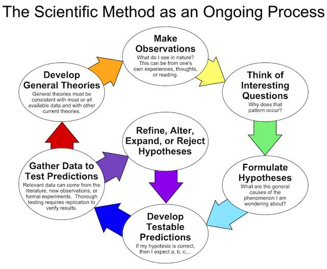
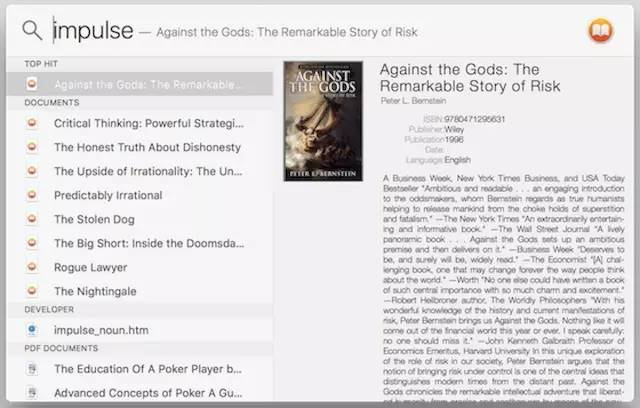

# 什么是更好的知识？
 
 在生活中，你若是遇到谁带着得意或者鄙视，脱口而出类似以下句子的人，你最好趁早避开他们……
 
 > - “你连这都不知道啊？！”
 > - “你才知道这个啊！”
 > - “我们早就不玩这个了！”
 
 他们是那种典型的“专刷存在感”的家伙。这种人非常在意也只在意他们当前的状态，他们甚至为了抬高自己的“形象”或者“地位”不惜践踏他人。
 
 并非所有的信息都是知识。这很明显，是吧？
 
 >**有价值的信息才可以算作知识。** 
 
 即便是在有价值的信息（即，知识）当中，也有应该价值高低之分，这也应该很明显是吧？
 
 在我眼里，**知识有两种：** 
 
 > -**无繁殖能力的知识** 
 > -**有繁殖能力的知识** 
 
 显然，有繁殖能力的知识，比无繁殖能力的知识更有价值；繁殖能力强的知识，比繁殖能力差的知识更有价值。
 
 什么叫有繁殖能力的知识呢？最好靠举个例子说明罢。**[科学方法论](https://en.wikipedia.org/wiki/Scientific_method)** ，就是一种有繁殖能力的知识，也是迄今为止我习得的最有繁殖能力的知识。
 
 
 
 它可以让我分辨什么是科学的，什么是不科学的，什么值得研究，什么不值得研究，什么需要验证，什么需要更多的验证，什么样的结论可以接受，什么样的结论不可以接受，什么样的结论有待观察…… 它在我筛选积累知识，优化知识结构的过程中起着不可或缺的作用。
 
 也就是说，有繁殖力的知识，引发思考，引发行动，引发改变，形成新的局面，并且，那些有繁殖力的知识，还会帮助你吸收、理解、运用更多有繁殖力的知识。再比如说，概率、统计，除了可以帮助我们更准确地理解这个世界之外，甚至可以直接用来赚钱……
 
 什么样的知识几乎没有任何繁殖能力呢？
 
 比如，
 
 > - “鬯”这个字究竟什么意思，怎么读？
 > - 贾平凹的名字里，第三个字读作 wà；
 > - 陈寅恪的名字里，第三个字读作 kè（对，就不是 què，就是 kè）
 > - “知识就是力量”究竟是谁第一个提出的？
 > - 中国究竟有多少个城市？
 > - 地球上究竟现在有多少人口？
 
 没有繁殖能力的知识，倒也不是没用，而是用处不大，甚至可有可无，有点像人类的盲肠，反正在那里，也不知道什么用处，切掉也没什么。
 
 这就好像这世界上每天都有人创作美妙的曲调，但我们就是无法全部知道，多知道一个少知道一个其实没什么太大的区别；但是，若是我们习得创造美妙曲调的方法，我们就也可以创作。虽然我们没办法说那些我们不知道的美妙曲调是废物，我们却也不应该也没必要因为我们自己知道一些别人不知道的美妙曲调而产生什么优越感（可大多数人就是喜欢这种优越感，其实挺耽误事儿的）；反之，若是我们真的可以创作，多少有点优越感也应该是必须的罢？
 
 哈，“鬯”这个字我用来举例，也十多年了，对我来说总算是有一点点生产力……这些年里我每说一遍陈寅恪（kè）就要被鄙视一次，也是很奇葩的体验。
 
 一般来说，有繁殖能力的知识：
 
 > 1.**可以积累，因为它有积累效应** 
 > 2.**必须应用，因为它有指导意义** 
 > 3.**值得传播，因为它可造福大众** 
 
 在计算机还没有出现的时代里，没有高效的“外脑”（外部存储），谁的“内存”越大（记忆力越强）谁更厉害。于是，那时候，知道的比别人多一点，记住的比别人多一点，确实是有优越感的。
 
 苏格拉底是坚决不写书的，因为他觉得要是脑子里装不下“那点”东西，就实在太可悲了 —— 在他那个年代里，知识总量只有今天这个世界的几亿分之一；而他也确实是那个时代里最聪明的人。在本杰明的时代里，国会议员们长篇大论十几个小时都完全是即兴发挥，全拼谁记忆力更好……
 
 别说那些伟人了，当年我在新东方讲课的时候，也是可以讲十节阅读课可以完全不拿书，带着学生一会儿翻到第 102 页，一会儿翻到 47 页，再翻回第 104 页…… 经常是学生们到了第三节课才发现台上讲阅读的老师竟然手里一直没有拿着书 —— 因为他们一直在台下听着指令忙着翻书 —— 突然之间掌声一片。可那又代表什么呢？只不过是我备课比别人认真一些，讲课讲得比别人熟练一些，仅此而已。
 
 不过，在硬盘越来越大越来越便宜，云存储满天飞的时代里，“博闻”更重要，“强识”却早已不再是什么优势了。
 
 我已经有很长的时间读书不写笔记了。为什么？因为有更大的硬盘了，有无限大的云存储了，更为关键的是 MacOS 有系统级内嵌的全文检索功能。于是，我尽量只买电子书，然后转换成 epub 格式存在硬盘里。读书的时候专心读，有用的地方刻意记住几个关键字，将来用得到的时候，全文检索一下，就可以轻松找到出处 —— 当然也有偶尔死活想不起来关键字要隔上好几天才想起来的情况…… 随着时间的推移，写上一两句批注的需求越来越少，若是真有启发，干脆写篇完整的文章算了。也就是说，**把大量用来“牢记”的时间，直接输入到“践行”之中，好像更为牢靠，更为划算。** 
 
 即便是“博闻”，也不再应该为了广博而广博，一味追求广度；而是应该尽量选择“繁殖能力”的知识，这不就是在提高产能吗？我实在看不出来一个人对豪车品牌如数家珍对他有什么具体的好处（在他并非一个知名汽车节目主持人的情况下），也实在看不出一个人对各种明星八卦明察秋毫的人对自己有什么效率和产能上的提升？天天不看一遍其实天天都一样的“头条”就很难受，其实挺浪费生命的罢。
 
**保持好奇心很重要，但若是竟然养成了猎奇心理，那就算是掉进坑了。**  这是个很大的陷阱。年轻人常常因此吃亏，迷恋一些“新”概念，虽然那概念或者那行为一点儿都不新，只是为了显示“与上一代不同”罢了——这其实是很古老的行为模式；有些人甚至即便在成年之后，也要靠不断强造“新”概念才能刷出存在感，这就比较可怜了 —— 因为那些玩意儿根本没有繁殖能力。
 
 

 
 Mac OS 的 Spotlight 原生并不支持 epub 文件检索…… 颇令人崩溃。
 
 还好有解决方案：[ePub-quicklook](https://github.com/jaketmp/ePub-quicklook)
 
 一共要[下载两个文件](https://github.com/jaketmp/ePub-quicklook)：
 
 > * epub.qlgenerator
 > * epub.mdimporter
 
 把这两个文件拷贝到以下目录内：
 
 > /Library/Spotlight/
 
 而后打开 Terminal （终端）输入以下命令：
 
 > cd /Library/Spotlight/
 > qlmanage -r
 > mdimport -r /Library/Spotlight/epub.mdimporter
 
 此后的全文检索就会包括 epub 文件了。（建立索引可能需要一段时间，比如十几分钟……）
 
 