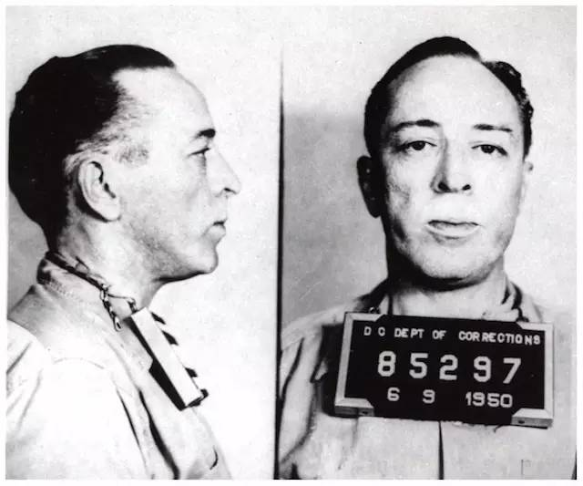
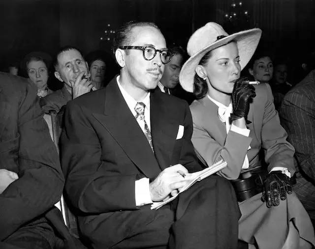
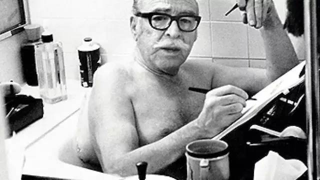
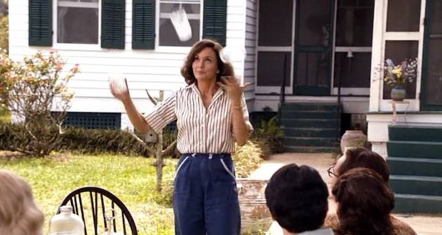
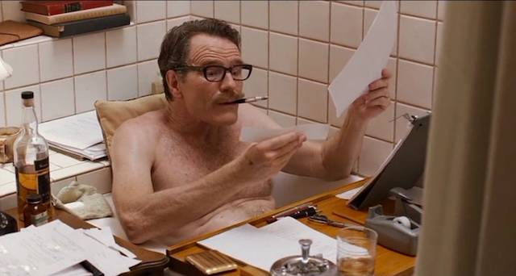
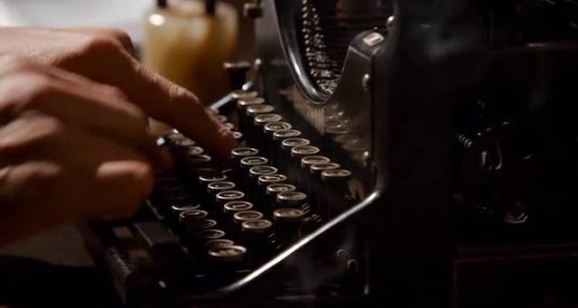
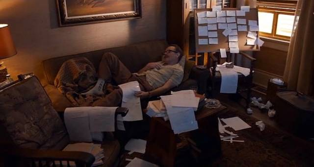
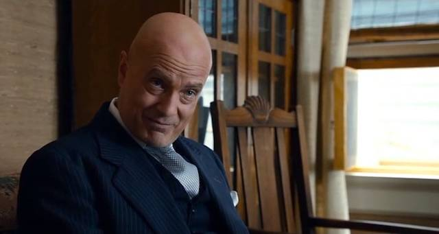
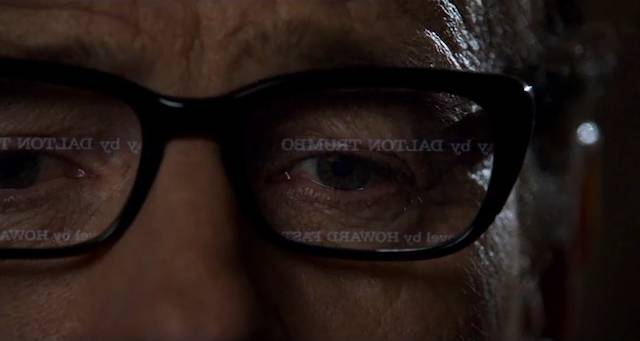
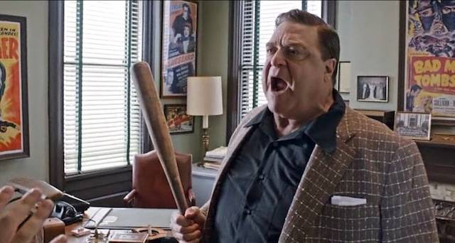

# 逆境生存指南 —— 特朗博做到了
 
 这一篇原本并没有想到应该放在《新生 —— 七年就是一辈子》里，但整理的过程中发现，这是个很好的补充。
 
 
 
 谁都可能遭遇逆境，因为“好花不常开，好景不常在”。逆境其实也分大小，但每个人遭遇到的时候，都感觉不小。因为大人物的遭遇常常是极大的逆境，否则瞬间就搞定了，而小人物的遭遇，即便是很小的逆境，按比例来看，对他们来说也足够大了 —— 因为搞不定。有些人起初并不伟大，只不过在遇到逆境的时候，不顾比例地不服输，“不知疲倦地翻越、不自量力地还手”（像李宗盛的《山丘》里唱的那样），终于走了过来，在这过程中，配合着逆境自己把自己养成了大人物。
 
 
 
 特朗博（Dalton Trumbo），一名擅长从冗长故事里发现精彩并能快速写出好剧本的好莱坞编剧，在美国的四五六十年代遭遇了极大的逆境：在美国人最恐惧共产主义的时代，他是个坚定的共产主义者，且绝不吝于公开表达。当人们并不真正了解之前并不存在的一样东西的时候（尤其是思想），对其要么恐惧，要么热爱；不管那东西对不对，只要是恐惧者居多，那么热爱那样东西的人就会受到迫害，历史上反复如是 —— 特朗博就这样被迫害了，最终被判入狱 11 个月。
 
 > 2015 年有另外一部传记影片，《模仿游戏》，计算机天才图灵的故事，看看那时候的人们是怎样迫害一个同性恋者的罢……
 
 对特朗博的迫害不仅仅来自于美国政府，也来自于美国当时的整个社会。美国政府判他坐了 11 个月的牢，出狱之后，特朗博要面对的是另外一个“判决”，好莱坞电影协会将特朗博和很多左翼编剧列入了黑名单，禁止电影公司采用这些黑名单中的编剧所写的剧本……
 
   
 （特朗普与他的妻子在 1947 年的听证会上…… 没多久他就被捕了）
 
 想象一下，身体健康的你突然被截肢了 —— 无论是被截掉一只手臂，还是一条腿 —— 有多么痛苦？特朗博相当于突然被剪断了舌头，一个有思想的人说不了话了、写出来却也没人能看到了……
 
 失业、离婚、自杀…… 这是特朗博很多同伴的结局。特朗博到最后都没有倒下，他不死心。出狱的时候，他说了这样一句：
 
 > ... We'll do what every else doesn't think we could do.
 > 
 > …… 我们要做所有人都认为我们做不到的事情。
 
 要赚钱养家，让妻子和两个孩子好好生活 —— 没有什么比家庭更重要。好莱坞最缺什么？最缺好剧本，所以特朗博知道自己不可能没饭吃 —— 他简直就是一台机器，一分钟 80 词的打字速度（看他的两根手指在机械打字机上飞舞），一天工作 18 小时，醒来就在工作台上敲字，累了就泡进浴缸接着敲…… 一两周就搞出一个高质量的剧本。有才华更应该勤奋，他要把被抢走的时间抢回来。
 
 
 
 《罗马假日》（Roman Holiday, 1953）就是他这么写出来的，对，就是你知道的那个《罗马假日》。自己在黑名单上怎么办？借用他人的名字，跟人家一九分账，自己要一……对方知道特朗博的才华，被这样的提议惊到了，哪里好意思自己出个名字就要九成？
 
 特朗博不仅自己搞定了收入，还要帮一群跟他一样被列入黑名单而失业了的编辑搞定收入。策略也很简单，集体匿名创作，批量生产，然后为了躲避耳目让电影公司上门自取或者出动自己的孩子去送剧本……
 
 真正的才华，别人是看得到的，也是自己藏不住的。这世界上也有形形色色的人物，有人害怕的时候他们不怕。有俩粗人，兄弟俩，搞了个电影公司，叫国王兄弟（King Brothers），专拍 B 级片，他们当然也一样缺好剧本，否则谁只拍 B 级片啊？别人不敢用特朗博，他俩敢。后来好莱坞电影协会的人跑来威胁这俩兄弟，这兄弟俩也不是吃素的，抡起棒球棍把那起初趾高气昂的孙子“打”了出去……
 
 特朗博的伟大之处在于，他分得清楚，电影就是电影，意识形态就是意识形态，这俩东西即便在少数情况下有所重叠，但不一样就是不一样。于是，他写剧本就好好写剧本，绝不夹带私货。他也不想刻意当什么战士，他只是精神上绝不屈服而已。他最令人感觉温暖的地方在于，他懂得理想之外还有家庭，家人最重要。
 
 《勇敢的小家伙》（The Brave One, 1956）大获成功，还得了奥斯卡最佳编剧奖，结果全人类都没见过那个署名“Robert Rich”的家伙……瞧这个笔名取的！姓“富”。大家开始猜测，这个“富萝卜”估计是特朗博。
 
 1960 年，导演奥托·普雷明格拍《出埃及记》（Exodus, 1960）的时候，坚持特朗博真实署名，这才让特朗博被截掉的肢体重新长了出来。
 
 同年，柯克·道格拉斯力排众议，邀请特朗博为他的新电影《斯巴达克斯》编剧，到了《斯巴达克斯》（Spartacus, 1960）上映的时候，肯尼迪公开表示那是一部极为精彩的电影，特朗博这才算是真正摆脱了那个黑名单的束缚。
 
 > 对了，柯克·道格拉斯的儿子是迈克尔·道格拉斯，就是那个《本能）（Basic Instinct, 1992）的主角，最近参演的一部电影是《蚁人》。
 
 特朗博就这样被逆境打造成了传奇。当一切成为历史，我们很难判断若是没有那个逆境，特朗博会是什么样子，会不会是今天我们看得到的这样传奇。
 
 在描述逆境的时候，人们更喜欢用“抗争”这个词，历史书、传记看多了，我却觉得用“配合”这个词反倒更恰当。当一个人从逆境中走出来之后，回头再看那逆境，暗流涌动的背后却可能是个机会，一个塑造传奇的机会。历史总是这样，它就像一条河，时不时地莫名其妙就产生了一处漩涡，大多数人被卷入漩涡，葬身河底，可总有一些人，“配合”着那暗流，走出一条生路，就成了传奇。
 
 特朗博的策略，其实并不是他独有的，细看历史上所有从逆境中走出来的人，大抵上都差不多：
 
 > - 他们就是很有才华；才华这东西，一点点不够用，必须很多很多；
 > - 他们因为有才华而更为勤奋，更不愿、不敢、不甘浪费一点点生命；
 > - 他们热爱家庭，那是生活的希望；
 > - 他们善待朋友，那是他们生存于世的关联与证据；
 > - 他们专注于做能做的事情，把最重要的事情做到最好；
 > - 他们与之斗争的，不是哪个人、或者哪群人，而是那个把所有人都变成受害者的历史漩涡；
 > - 他们最终从逆境里走了出来……
 
 当这样的人走出来的那一瞬间，过往的对错其实都不重要了，重要的只有一件事儿：他们走出来了。
 
 《Trumbo》是 2015 年我最喜欢的电影。至于它能不能得奥斯卡大奖，其实无所谓了。最近的十年，已经证明奥斯卡评委基本上都是与这个世界脱节的自以为是的家伙们。IMDB 上这部电影打分并不高，只有可怜的 7.5 分。电影本来就是由年轻人主导的市场，票房和打分从来都不一定和质量完整正相关。美国今天的年轻人更关心的是“为同性恋争取权益”这样更为时髦的正义 —— 肯定也没什么不对。历史么，从来都是大多数人不喜欢审视的东西。
 
 有很多老戏骨出演这部片子，故事里的角色，大多是当年好莱坞的各种大腕，细看都颇为神似。国王兄弟轮棒球棍那个桥段拍得极为出彩，有气势，绝对能吓倒对方，却又出手其实小心，绝不真打到人所以不至于犯罪……
 
 > 视频链接：
 > http://v.qq.com/page/m/3/b/m0182b3qj3b.html
 
**电影里没提到的几件事情** 
 
 > - 特朗博曾经专门给儿子写了一封信，讲自慰的好处，说那是一种无需罪恶感的好方式。
 
 > - 特朗博在一次采访里说，每个人都有表达的权利，不管是好主意、坏主意、怪主意、还是恶心主意…… 不仅如此，人们还有犯错的权利（The right to be wrong）。
 
 > - 《斯巴达克斯》这部电影，特朗博的剧本是基于霍华德·法斯特（Howard Fast）的同名小说，就是那个斯大林大奖（Stalin Prize）的得主……
 
### 剧照
 
 特朗博的妻子，跟所有热爱生活的人一样，“身怀绝技”……
 
 
 
 当然不能没有浴缸里创作的桥段……
 
 
 
 两个指头敲字的镜头也绝对不能没有……
 
 
 
 累死可以，但不能饿死。另外，板子上贴满了纸片，这是创作者的基本工作方式…… 其实到今天都一样的。
 
 
 
 导演奥托·普雷明格坚持在他的新电影里，特朗博要实名署名……
 
 
 
 特朗博看到自己的名字出现在屏幕上，老泪啊！
 
 
 
 Frank King 可是被吓大的，怎么可能怕威胁？
 
 
 
**补充** 
 
 wn.com 做了一个专栏：“How Dalton Trumbo and other blacklisted writers quietly racked up '50s Oscar wins”，里面有十几个值得看看的视频文件，包括 “Dalton Trumbo interviewed by Stan Bohrman”……
 
 > http://t.cn/RbEyxbY
 
 这些视频其实比电影更精彩，毕竟，电影是关于这个人的。
 
 