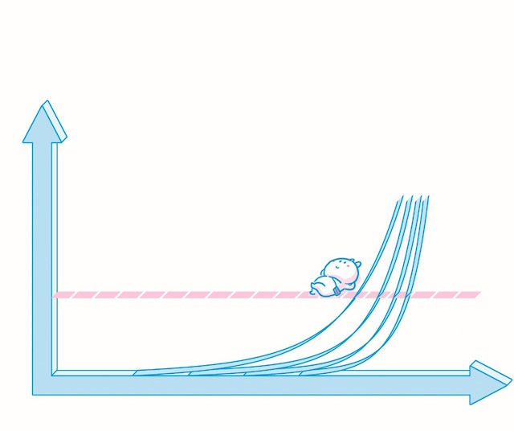

# 越早越好
 
## 越早开始越好的事情没几个，理财排在第一位
 
 理财是人生最重要的技能—没有“之一”，可大多数人就是不会。很多人想学却没学明白，有人干脆拒绝理财—觉得费那劲根本没用。全球都一样。
 
 美国的调查统计数据是这样的[^1]：
 
 > - 56%的人没有为自己存一笔“应急钱”。
 > - 46%的人给自己准备的“退休金”低于10000美元。
 
 这说明，大部分人是没有理财准备的。
 
 中国的调查统计数据是这样的[^2]：
 
 > - 59%的家庭正在或者曾经进行投资理财。
 > - 18%的家庭从未进行投资理财，但未来半年会考虑进行投资理财。
 > - 23%的家庭拒绝理财。
 > - 在有理财经历的家庭中，45% 的家庭的理财行为未有明确的目标，随机性较强，21% 的家庭有比较明确的理财目标，15% 的家庭已将理财视为生活的乐趣。
 
 这说明，大部分的家庭也缺少理财的观念。
 
 很多人遗憾学校里不教理财，这其实也不怪义务教育体系的设计者。
 
 > - 全球都一样，有能力教理财的老师明显不够用[^3]。
 > - 无法通过标准化考试去衡量教学效果。
 > - 可能引发教育不公正，因为理财实践过于依赖家庭条件。
 > - 其实已经尽力教了，例如加、减、乘、除，还有利息、复利什么的。
 
 还有很多说不明、道不白的理由。
 
 细想想，关于“大多数人不会理财”这个事实，“学校里没教”其实并不是理由，因为学校里教的他们也没全学会。
 
## 先说说那块著名的棉花糖
 
 1970 年前后，斯坦福大学的教授 Wlater Mischel 进行了一个著名的心理学实验—“棉花糖测试”。
 
 > 每次实验时，屋子里只有一名学龄前儿童和一名实验者。孩子坐在小桌子前，桌子上只有一个盘子和一个摇铃，盘子里有一块棉花糖。实验者对孩子说，自己要到隔壁屋子“干活”，如果孩子想吃这块棉花糖，就摇铃，实验者马上会回来，孩子就可以把棉花糖吃掉；但是如果孩子能忍住不吃，一直等到实验者“自己回来”，那么孩子可以吃两块棉花糖。
 
 多数孩子当然忍不住诱惑，不到15分钟就吃掉了那块棉花糖。只有 30% 左右的孩子“拼命”忍住，最终吃到了两块棉花糖—这些孩子才 4 岁，就已经展现出了惊人**自控能力** 。
 
 实验并未就此结束。在后面的 20 多年里，除了 Wlater Mischel 之外，还有很多人做了跟进实验，最终的结果多少令人震惊：能抗拒诱惑、有足够自控力的孩子，长大之后，SAT 成绩平均高出 210 分；而从整体来看，他们的生活质量相对更高。
 
## 回来说说理财的事
 
 对大多数人来说，理财的困难与矛盾来自这样一个窘境**很难很早开始，等开始的时候已经太晚。** 
 
 所谓的理财，理论上并不应该狭义地理解为去银行买理财产品。存钱、做预算、控制开销、赚更多利息、赚利息差、正确使用信用卡、购置不动产、投资一些多少有风险的标的，这些都是理财活动。所谓理财，这个定义比较合理、准确：
 
 >**如何有效管理现金流** 
 
 —— 这其实与钱多钱少关系不大。
 
 开始工作之前，大多数人没有收入来源，对很多人来说，这样的时候攒钱和存钱没有意义，因为那些钱其实是“一直存在父母那里的”，也就是说，理财这事儿实际上是父母“包办”的—可实际上大多数父母并不理财。
 
 在“棉花糖实验”的跟进实验中，研究者发现，贫穷与自制力差有很大的正相关。这也很容易解释**贫穷意味着诱惑显得更多、更大、更明显。** 也就是说，即便在自制力实际上差不多的情况下，贫穷的个体与富有的个体相比，贫穷的个体也会表现得更差。
 
 年轻人相对是穷的，于是，相对来看需要更多的自制力才能抵制诱惑。这其中的重要因素是**不同年龄段的人对时间的感受不同。** 对一个 5 岁的孩子来说，等待 1 年，相当于等待他已经感受过的“一生”的 20%；对一个 50 岁的人来说，等待 1 年，相当于等待他已经感受过的“一生”的 2% —难易程度之间的巨大差异可想而知。正如乔辛·迪·波沙达在TED上的讲演中提到的：告诉一个 4 岁的孩子要等 15 分钟才能享受他喜欢的东西，就如同告诉我们大人，“我们 2 小时后会给你送咖啡过来”。
 
 顺带算一道很简单的数学题。根据以上信息，乔辛·迪·波沙达所说的“大人”应该是多少岁？
 
 
 
 上面提到的“大人”的年龄（x）大约是32岁。
 
 话说回来，基于以下几个常见的理由，大多数人并没有在年轻的时候就开始理财：
 
 > - 父母本身很可能没有足够的理财知识和理财活动；
 > - 基数太小的时候，利息什么的看起来很没劲—即使上学的时候学习过复利计算；
 > - 需要很长时间才能体验结果—对年轻人来说，等待的时间显得更长；
 > - 诱惑就在眼前，且显得更大；
 > - 更多的情况下，大多数年轻人对“理财”的定义理解错误，以为理财是需要去银行排长队才能干的事情，而不是“如何有效管理现金流”，于是把一个原本从很早就应该开始做的事情当作无所谓的事情处理了……
 
 还有一个特别逗的现象：人们对自己不擅长的事情有特殊的处理手段—最终会通过包装进行自我保护。“谈钱不就俗了吗？”或者“我才不想成为天天只会算计的人呢！”这其实是对自己的大脑实施**永久性伤害** ”—很难恢复。
 
## 为什么今天的人更应该重视理财呢？
 
 理由特别简单，最重要的是：
 
 >**人们的平均寿命变得更长了。** 
 
 平均寿命增加了多少？全球范围内各地区不等，但总体上是两代人的时间，平均寿命增加了 15 ~ 30 年。
 
 另外一个与之相关的因素是**人们可获得收入的工作时间也随之变长了。**也就是说，从全球范围来看，人们理财的环境变得更“现实”了，有更多的钱需要管理，有更长的时间去管理钱，而最为重要的是 —— **哪怕起点稍微低一点也无所谓了。** 
 
 如果你还没开始，那就从现在开始吧。反正都来得及。
 
 
 
## 理财成功与否与聪明与否的统计关联最小
 
 投资理财的成功与否，从本质上来看，与一个人是否聪明的关联是最小的，因为事实上理财需要的知识相对简单，会加、减、乘、除，会做简单的调查比较即可。
 
 理财最难的地方有两个：
 
 > - 对自我的把控
 > - 对风险的把控
 
**这两个都是可习得的，且习得之后不可逆的技能。** 更为重要的是，这两个都是必须通过反复实践才能习得的技能。
 
 Walter Mischel 在他的书中提到，他通过这样的训练使 4 岁的孩子瞬间提高了自制力：“你把这张桌子想象成一个大画框，这个盘子和这块棉花糖都是画中的东西，其实吃不到的……”
 
 而另外一组小朋友却没有这样的提醒。相对来看，把棉花糖想象成画中之物的孩子，自控力要比没有获得提醒的孩子强出很多 —— 原本只有不到 1/3 的孩子可以忍住，现在有 2/3 以上的孩子可以忍住。
 
 仔细观察那些不通过提醒就能忍住的孩子，他们最常用的做法就是**转移注意力** ”：站起来四处遛达，或者坐在桌子底下哼歌…… 而那些忍不住的孩子，几乎共同的特征就是死盯着那块棉花糖看，结果就是 —— 诱惑显得越来越大。
 
**转移注意力是抵御诱惑的一种常用的有效手段** ，这其实也是后来理财成功的人常用的手段。他们会尝试着骗自己，把那些定期存款或者股票投资当作“已经丢了”，尽量不去想它，不去看它。这跟聪明与否其实没有什么关系。有时候，骗骗自己也挺好的，不是吗？
 
 Walter Mischel 教授在他的书中没有提到另外一个跟进实验。2012 年，罗切斯特的研究人员做了这样一个设定：
 
 > - 第一组孩子在进行棉花糖测试之前经历过一次被承诺却未实现的情况，比如，有条件地答应给孩子一件礼物，后来条件满足了却没有给孩子礼物；
 
 > - 第二组孩子在进行棉花糖测试之前经历过一次承诺被实现的情况，比如，有条件地答应给孩子一件礼物，后来条件满足了，孩子就真的拿到了礼物。
 
 结果怎样呢**第二组孩子表现出的自制力比第一组孩子高 3 倍！** [^4] 因为对第一组孩子来说，生活教育他们，“马上吃掉”才是最佳策略，至于承诺的第二块嘛，本来就不存在！那些随便给孩子承诺，而后又经常让孩子失望的家长们，面壁去吧。你们的下一代就那么轻易地被你们毁了，你们也完全不知道——说你们点啥好呢？！
 
 关于对风险的把控，更是与智商、与遗传没关系的事情。前面提到过，有研究表明，婴儿第一次见到蛇就害怕，见到枪却无所谓。为什么呢？因为对蛇的恐惧是根植在基因里的，对枪的恐惧嘛，离“可通过遗传获得”还差几万年的光景呢。于是，理财上的风险意识，跟遗传没什么关系，跟智商关系也不大，它是必须通过自己的实践、通过自己的失败、通过自己的教训、通过自己的总结才能获得的东西—哪怕在书上看过、听别人说过也没用。
 
 所以说，理财这件事肯定是越早开始越好。年轻的时候理财虽然难，但即便发生风险，损失也不会太多—因为本来就没有太多。等可管理的财富多了才开始学习，一旦损失，就肯定惨重得多。在这种情况下，尤其可怕的是—剩下的时间不多了！
 
## 小结
 
 2014 年，Walter Mischel 在 CBS 的采访中说，
 
 > “我现在最感兴趣的是，在‘棉花糖测试’中失败的那些孩子里，有少数最终学会了自控，成年后也非常优秀，他们是怎么做到的？”
 
 不管怎么说，这只能证明，自控与自制是可以习得的，并且，一旦习得就不会失去，这才是关键。而反过来，开始学习理财，可能也是改善自制力、自控力的方法，不是吗？
 
 

 
 [^1]: 数据来自FINRA Investor Education Foundation。
 [^2]: 数据来自平安大华与益普索Ipsos。
 [^3]: 当年我的硕士教授里面有炒股专家、长江证券的顾问，其实是幸运的，可惜当时没有想过理财。
 [^4]: 详见 http://www.rochester.edu/news/show.php?id=4622。