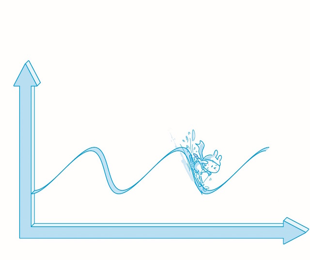
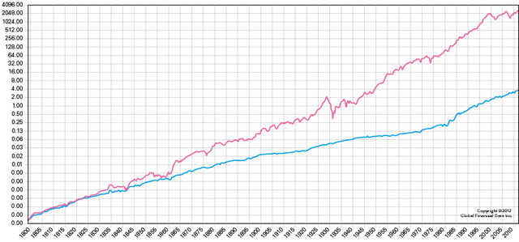
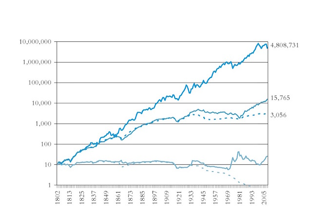
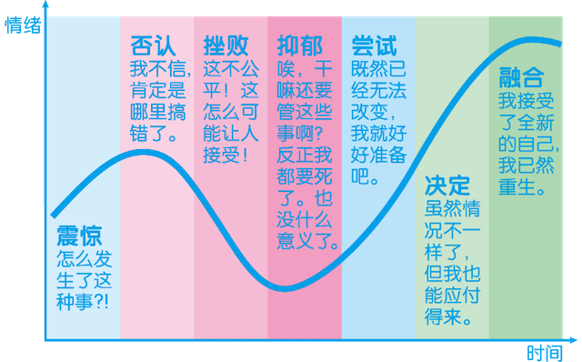
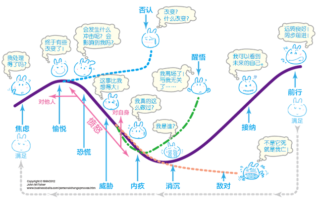

# 认识周期
 
 周期是理财投资活动中最为关键的考量因素，是开始实践之前必须学习、研究、掌握、遵循的理念和现实，可惜总是被忽略。周期也是市场上大多数理财书籍中干脆不提，或者放在最后一笔带过，实际上却是最为基础、最为关键的知识点。
 
**不深入了解周期，就无法进行有效的判断** ，整个理财投资活动基本上就等于是没有判断的行为，甚至比不过两个人抛硬币赌博。而在这样的时候，墨菲定律一定会显灵：如果一件事可能变坏，那么它一定会变坏。
 
 周期这个概念，在很多投资者、理财者口中，通常以“趋势”这个词替代。他们会说：
 
 > - “现在是上升趋势”
 > - “现在是下降趋势”
 
 这种描述尽管有时候还算管用，但更多的时候却是肤浅的、危险的，因为一个上升趋势要加上一个下降趋势才构成一个完整的周期。而实际上**真正的趋势常常需要在多个周期（至少2个）之后才能真实展现。** 
 
 
 
 如果我们探究的是真正的趋势，就会发现，上升与下降只不过是一个真理的表象 ——**现实的经济里没有直线，只有波（动）。** 
 
 在一个很长的波段中，从任何一个点前后望，看起来都像自己身处在一条直线而不是曲线上，就好像我们站在地球上却很难感知我们自己其实是站在球面上而不是平面上一样。
 
 一个上升与一个下降构成一个周期。2 个或多个周期之后，如果我们发现曲线就好像是数学课本里的 *sin* 曲线的话，那么所谓的“趋势”实际上就是一条水平线而已，而我们常常说的且在寻找的所谓“趋势”应该是个要么上升、要么下降的线条才对，因为“水平”等于“无变化”，无变化就无趋势。 
 
 
 
 这就解释了为什么有些人认定的所谓的趋势在另外一些人眼里根本谈不上是趋势，因为后者重视的是1个以上的周期之后所显现的真正的趋势。这也解释了为什么“跟涨杀跌”的人必然吃亏，因为他们所看到的并不是实际的趋势，他们看到的和把握的只不过是幻象而已。
 
 下面是 1800 年至 2012 年的股票和债券收益的收益比较图，红色是股票指数（SPXTRD），蓝色是债券指数（TRUSG 10M）。 
 
 
 
 起起落落这么多年，股权投资和债权投资的趋势其实是一样的 —— 都在上升。只不过，虽然债权投资“看起来更稳定”，即波动相对比较小，但涨幅却落后于股权投资。
 
 
 
 而从上面这张图中我们会发现，长期来看，投资黄金、美元比起投资股票简直是“弱爆了” —— 不管你同不同意。这也是为什么现在越来越多的人认为“股权收益时代来了”的重要原因 —— 其实早就存在了。
 
 所以**关注周期，以及多个周期背后显现出来的真正趋势，会给你一个全新且更为可靠的世界和视界。** 
 
 进而，几乎一切事物，无论是抽象的还是具体的，都有它自己的周期。而他们的周期不大可能一致。于是，几乎一切的机会和陷阱都隐藏在周期与周期之间的差异上。据说GDP和股市的周期轮换如下图所示。 
 
 还有个“库伯勒 —— 罗丝改变曲线”（Kübler-Ross change curve）特别好玩，它看起来是这样的。
 
 
 
 更进一步，人们发现，任何新生事物的发展过程（Transition Curve）也是差不多的。
 
 
 
 于是，我们可以反思这样的现象了**每次巨大技术变革出现的时候，都有一批投资者死在路上。** 为什么呢？因为他们看到了所谓的“趋势”，却忘记了或者不知道真正的趋势需要 1 个以上的周期才会真正显现。回顾一下历史吧，互联网、NetPC（后来所谓的“云”）等都是如此。再如，我相对比较了解的比特币，现在在这样一个阶段：比特币正在引发很多人的愤怒。
 
**对周期的深入理解，甚至可能影响一个人的性格。** 在我看来，所谓的不屈不挠，所谓的坚持不懈，更多的时候，只不过是因为对自己身处某个周期的某个位置非常了解，所以才更容易作出的决定。
 
 事实上，如果你需要理财顾问或者保险顾问[^1]，你会发现，真正专业的理财师、保险师最终都是从你的情况出发，即从你身处的生命周期与经济周期的具体节点出发，制定你的理财计划。
 
 对于理财，我没打算把这篇文章写成一个“实操指南”，因为这其实没多大意义。理财、投资的人，各有各的不同。就好像一个动物园里，有老虎、狮子，有鹦鹉、孔雀，有鳄鱼和蛇，还有很多不知道在哪里的昆虫，它们都有自己的生存之道，都有自己的优势和劣势，没有太多实际上有意义的、通用的、普适的优势策略。在本文中，我尽量写出关键节点，属于“道”的内容，至于属于“术”的内容，需要读者自己学习、研究与磨练。
 
 如果非要挑出来的话，倒是有一个**繁殖能力强是王道。**拿到理财与投资里说，就是**存的越多越好。** 
 
 太简单了吧？简单到好像没必要教育或学习似的。其实这也是传递重要知识时所面临的困惑与困难 —— 越是重要的东西越是看起来并不相关。比如，品质生活其实与审美能力更正相关，与钱的关系并不大，但是钱却看起来是最重要的、也被认为是最重要的因素。再如，当年我教英语的时候也发现，背单词的方法、找外教之类的学习环境其实都没有另外一个简单的字重要 —— 用。可越是重要的东西，说出来之后越是简单到令人不由自主地轻视。还有，性高潮其实与大脑关系最大。
 
 

 
 [^1]: 保险其实也是理财的一个重要领域。