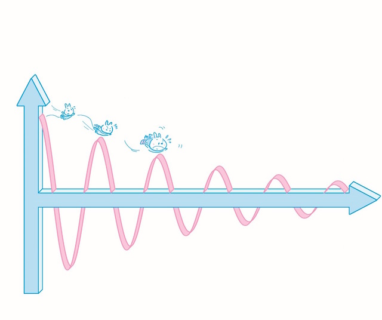

# 别做“险盲”
 
 假设有两个人玩公平的抛硬币赌输赢的游戏，规则是：
 
 > - 赌注大小恒定
 > - 直至一方输光游戏才能结束
 
 请问，最终决定输赢的是什么（单选）？
 
 > A.手气
 > B.谁先抛硬币
 > C.抛硬币次数
 > D.总游戏时长
 > E.以上皆是
 > F.以上皆不是
 
**“险盲”** 是我借用“文盲”这个词的结构杜撰出来的一个词汇，是指那些不了解风险，不知道如何回避风险，更不懂如何控制风险的人。文盲的一生其实很吃亏，险盲的一生更是如此。文盲可以通过（自我）教育得到解放，险盲也一样。
 
 风险教育应该是理财教育，甚至应该是整个教育中最重要的组成部分，也不知道为什么它竟然一直被忽略，顶多在学校里搞个防火模拟演习。火灾其实只是风险的一种，有一个术语是“不可抗力造成的系统风险”。这也是为什么我们必须不断自我教育的原因**仅靠别人教永远是不够的，要靠自己学才行。至于“活到老，学到老”，其实只不过是一种生活方式。** 
 
 如果你在做上面的选择题的时候多少犹豫了一下，或者选择的答案竟然不是“F”，那你还真的多少就是一个险盲。不过，一篇文章的光景，就基本上可以“扫盲”了 —— 这本身不是一件困难的事情。
 
#### 首先，要平静地接受第一个事实：风险是一种客观存在。
 
 风险就在那里，不离不弃，并不会因为你怕或者不怕它就有所变动。甚至，从广义上来看，即便你什么都不做，还是时时刻刻有风险的陪伴。
 
 为什么风险几乎永远存在呢？因为第二个事实。
 
#### 第二，一旦未知存在，就有风险存在。
 
 为了了解风险、研究风险、回避风险，甚至控制风险，人们鼓捣出一个数学的分支 —— 概率统计。这几乎是所有人都应该认真学习的学科，只可惜，好像绝大多数人都只是应付一下考试就把如此重要的知识“还给老师”了。
 
 在学过一点概率的人之中，有一个普遍的误解就是认为“风险的概率决定风险的大小”，可实际上，衡量风险的首要因素并不是风险的概率 —— 这就是我们要提到的第三个事实，也几乎是摆脱险盲的最重要的事实。
 
#### 第三，衡量风险大小的决定性因素是赌注的大小。
 
 关于之前的那道选择题，最终决定输赢的是谁的赌本更多。
 
 由于赌注是大小恒定的，又由于抛硬币是概率为¹⁄₂的游戏，所以，如果双方赌本一样多，那么最终双方输赢的概率就都是¹⁄₂。可是，如果一方的赌本更多，那么他最终获胜的概率就会更大。由于玩的是概率为¹⁄₂的游戏，所以，如果其中一方的赌本是另外一方的2倍以上，那么前者几乎必胜。也就是说，在这个游戏里，赌本相对越多，输的概率越趋近于零。
 
 如果你参与这个游戏，一上来发现那个“恒定大小的赌注”比你的总赌本还多，那么你就不应该参与。如果你的赌本只够下 1 注，虽然赢的概率依然是¹⁄₂，但从长期来看，你没有任何胜算。
 
 很多人看起来一辈子倒霉，可实际上，那所谓的“倒霉”是有来历的。他们对风险的认识是错误的。他们倒霉的原因只有一个：
 
 >**动不动就把自己的全部赌进去。** 
 
 赌注太大，则意味着结果无法承受。为什么赌本少的人更倾向于下大赌注呢？据说是越差的人梦想越大。高速公路上开得很快还不愿意系安全带的 —— 险盲，因为这些人不知不觉就把自己的性命当成了赌注。经常做铤而走险之事的人 —— 险盲。股市里怕自己赚得少，拿出全部身家（甚至借钱，更甚至借钱做杠杆）的人 —— 险盲。
 
 上面的讨论其实涉及第四个重要的事实。
 
#### 第四，抗风险能力的高低本质上就是总赌本的大小，尤其是在面临同样概率的风险的时候。
 
 反过来看，赌注恒定，赌本却相对无限大的时候，即便遇到 99.99% 的风险概率，玩家其实也全然无所谓，因为赌注相对太小，输了就输了吧。
 
 还有一个现象需要注意**赌注相对大的时候，智力会急剧下降。** 为什么高考的时候总有一些人考砸？就是因为赌注（未来一辈子）太大，以致压力太大，进而无法正常发挥。
 
 同样的事情也发生在国际台球大赛上。那些天天刻苦训练的选手，每一个在训练的时候都能经常打出“满贯”，但在整个赛季都没有几个选手能在赛场上做到。为什么呢？就是因为赌注太大了。平时训练的时候没什么赌注，也就没什么压力。这也可以反过来解释一个常见的现象：历史上所有成功的庞氏骗局都有一个普遍的重要特征，那就是“加入费用惊人地高”，因为只有这样，进来的人才能普遍不冷静。
 
 所以，人真的不能穷，不能没有积蓄，否则真的会在某一瞬间突然变傻。另外，永远不要“All In”。这在很多时候并不是空话，真的需要放在心上。
 
#### 第五，冒险没问题，但尽量不要被抽水。
 
 “抽水”是赌场里的术语，是指赢家要支付盈利中的一定比例给庄家。不要以为赌场太阴险，实际上，开赌场、保证公平就是需要开销的，所以，玩家支付抽水是合理的。也不要以为股票交易所太贪婪，它们收手续费也是合理的，这就是无所不在、不可消灭的“成本”。
 
**公平是有成本的。** 有抽水机制的赌局本质是倾斜的。因为即便是抛硬币的游戏，加上抽水机制之后，长期来看所有的玩家也都会输光，所有的赌注最终都会转化成抽水者的利润 —— 就好像一个正弦函数被改造成阻尼正弦函数一样。
 
 
 
 