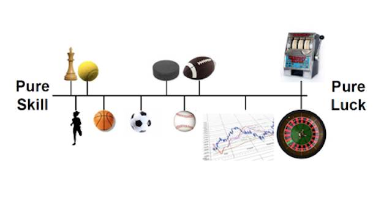

# 如何回避坏运气
 
 当人们在某件事上获得成功的时候，通常有两个要素在起作用：
 
 > - 技能
 > - 运气
 
 从这个角度望过去，成功可以用一个公式表达：
 
 >**成功 = 技能 + 运气** 
 
 这里的运气，可能是好运气，也可能是坏运气。
 
 在不同的活动中，这两个因素各自所占的比例可能非常不同。我们可以画一条直线，在最左侧写上技能，在最右侧写上运气，那么不同的活动可能在不同的坐标点上 —— 越靠左边的就越更多依赖技能、更少依赖运气；越靠右边的越就更多依赖运气、更少依赖技能。极端的情况下，有些活动完全不依赖运气，只靠技能，比如下棋，比如学习跑步；而另外一些活动着完全靠运气，与技能无关，比如买彩票。
 
 
 （插图摘自：The Success Equation: Untangling Skill and Luck in Business, Sports, and Investing）
 
 The Success Equation 的作者 Michael J. Mauboussin 提出了一个很巧妙很直观的模型去思考技能与运气之间的关系 —— 为了说明方便，我略作了修改，所以算作是借用了他的模型：
 
 > 想象一下，我们有两个不透明的瓶子 —— 第一个里面装着三个分别印着 1、2、3 的蓝色的球，代表技能；而另外一个瓶子里装着三个分别印着 -5、0、5 的红色的球，代表运气。
 
 现在我们从两个瓶子里各自拿出一个球，加起来的分值就是最后结果…… 那么，大概有 1/3 的概率结果为负值，这就好像一个人开车技术并不怎么样的时候去飙车却赶上坏运气出了事故当场死亡一样 —— 相当于他当场从人生中出局。
 
 如果第一个瓶子里的三个球，数值分别是 4、5、6，而这三个球分别代表三个人的话，那么技能值为 4 的那个人有 1/3 的概率“出局”，技能值为 6 的那个人无论如何都不可能“出局”。
 
 如果三个人的技能值分别是 7、8、9，那么无论是谁，即便在最坏的情况下，也都无需“出局”。若把每次拿出两个不同颜色的球算出结果看做是一系列比赛中得一局，不断进行下去，长期来看，运气时好时坏，那么运气最终会被抵消掉，所以，到底还是技能起着决定性的作用 —— 前提是技能值要高到不可能被坏运气变成负数。
 
 在这里，我们正在讨论**所谓“运气”，是完全不可控的** ，它可能是好的，也可能是坏的，也可能是“0” —— 即，什么影响都没发生。我们不知道它什么时候发生，不知道它是好是坏，也不知道它好坏的程度到底如何；我们只知道最坏的情况下，坏运气可能导致“灭顶之灾”。
 
 与之相对，技能却是可控的 —— 通过刻意练习（deliberate practice），绝大多数技能都可以获得极大的提高。
 
 于是，由此直接可以想到的应对策略是：
 
 >**通过选择来回避坏运气。** 
 
**选择很重要。** 甚至可以不夸张地讲，人生就是选择。对于选择这件事，我的好朋友铁岭有个精彩的陈述：
 
 > 所谓的（创业）成功，无非是解答题高手作对了选择题。
 
 可这世界上真的有很多人不相信自己有选择的！更准确地讲，他们骨子里完全不相信[自由意志](B05.md)的存在。说实话，我完全没办法理解那些不相信自由意志存在的人有什么接着活下去的必要……
 
 我们可以通过两个层面做出更优的选择：
 
 > - 提高技能值
 > - 降低坏运气的绝对值
 
 或者换个说法：
 
 > 在“技能-运气”的横轴上，尽量选择去做靠近左端的活动，就是那些更多依赖技能，更少依赖运气的活动。
 
 下棋、学习，都是完全不靠运气的 —— 只靠积累。于此同时，无论做什么，都需要技能，而技能只能靠积累。
 
 再换个说法：
 
 > 在技能没有达到一定程度的时候，别指望运气。因为坏运气在这种情况下其实格外可怕。
 
 我花了很久才把表达方式理顺 —— 要先定义清楚 Serendipity（我所说的“惊喜”，普遍的翻译是：意外的好运）究竟是什么，才能把它与被定义为不可控的“运气”区分开来：
 
 > 所谓的惊喜（Serendipity）就是
 
 > - 原本想象不到的好事儿“竟然”发生了…… 
 > - 或者反过来说也行，原本想象不到的坏事儿“竟然”没有发生……
 > - 甚至，原本想象不到的坏事儿即便真的发生了，也没有造成“毁灭性打击”……
 
 所以说，学习（磨练技能）永远是创造惊喜的最根本手段：
 
 > - 当坏运气发生的时候，有能力抵御、有能力承受，那么坏事可以变成好事—— 因为那些没有干掉我们的事儿会使我们变得更强（“What doesn't kill you makes you stronger” —— 有首歌的歌名就是这句话。）……
 > - 若是没有能力抵御、没有能力承受，那么坏事就铁板钉钉，又因为“因此要提前出局”所以要蒙受的损失大到无法估量……
 
 所以，当我们说惊喜可以创造的时候，我们并不是说我们有本事完全剔除坏运气 —— 坏运气永远可能发生，且总是在最不该发生的时候发生（可能正因如此才算得上是真正的坏运气）。
 
 当我们说惊喜可以创造的时候，我们其实相当于在说：
 
 > - 原本想象不到的好事儿“竟然”发生了…… （这**当然的惊喜** ）
 > - 原本想象不到的坏事儿发生了，别人被摧毁了，我们却扛住了、挺过去了……乃至于后面又发生了很多好事儿 —— 而这些好事，若是我们早就被摧毁了的话，原本是不可能存在的……（这**争取来的惊喜** ）
 
 从这个角度来看，所谓的学习，本质上是在提高自身的“免疫力”，让自己不被病毒打倒。这个类比告诉我们，有的时候，我们甚至有必要主动给自己下毒 —— 这就是打疫苗的原理。你看，[类比真的影响思维](A09.md)。
 
 这一篇相当于给《[惊喜的定义与创造惊喜的方法论](A18.md)》中的七个原则中的 1、2、4 做了更多的解释：
 
 > 1.**你必须相信你自己会有好运的** 
 > 1.**尽量不做可能倒霉的事情** 
 > 1. 保持开放
 > 1.**持续学习** 
 > 1. 创造更多的连接
 > 1. 保留适当的随机
 > 1. 多管齐下，齐头并进
 
 很多人其实是不相信自己会变得更好的 —— 本质的原因是他们各项技能在某个时间点开始彻底停止进步，而自己骗自己多少有些难度，于是已经接受自己“就是那样了”的现状…… 这样的人，是没有办法相信自己会有好运的，只因为他们没有办法相信自己会变得更好。这样的人，其实早已经不再有未来，也就更没办法对自己的未来自信 —— 只是他们自己意识不到，没有能力想得这么清楚而已。这样的人，没有坏事发生就已经该谢天谢地了，根本不可能有什么惊喜。