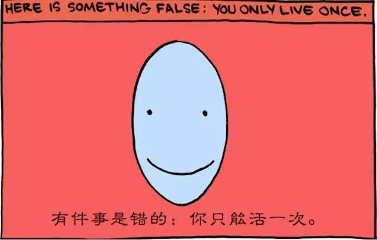
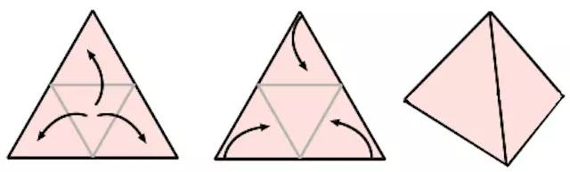

# 自序
 
### （一）
 
 2015 年 11 月份刚开始写的时候，书名暂定为《七年就是一辈子》。最终在整理文稿的时候（2016 年春节），我决定把“七年就是一辈子”当作副标题，书名改为《新生 —— 七年就是一辈子》。
 <!--
 为此，我专门注册了一个域名：
 
 > [xinshengdaxue.com](http://xinshengdaxue.com)

 “新生”，在这里是双关语：
 
 > - “新的学生”：我的一生只有一个职业 —— 学生，这个社群里有很多跟我一样的人……
 > - “新一辈子”：我们相信七年就是一辈子，一生可以有很多辈子 —— 可以做很多事情，过很多不一样的生活……
 
 对，《新生》不仅仅是一本“书”，它实际上也是一个社群。
 --> 
### （二）
 
 漫画师 David Saracino 有一幅连环画，叫《11 辈子》（[11 lifetimes](http://www.smbc-comics.com/?id=2722)），2012 年推出的时候，我一看到就很喜欢，后来[我也在微信公共账号上发过这幅连环画的中译版](http://t.cn/RUnvsLK)。
 
 
  (点击上图查该看连环画完整版)
 
 很多年来，我自己就是这么认为的：
 
 > 掌握任何一项新的重要技能，都相当于重生。
 
 重生的意思是说，新的一辈子开始了，上一辈子结束了。学习的结果是不可逆的，尤其对生活的影响更是不可逆的 ——**学了却没有改变生活，那其实就是根本没学会。** 
 
 七年就是一辈子 —— 而我多年的经历也确实如此。21 岁之前，我学会了如何学习，28 岁之前，我学会了如何销售，35 岁之前我学会了如何传递知识，42 岁之前我学会了如何创业如何投资，2015 年我 43 岁，正走在一条之前自己从未想象过要走的路上……
 
 我早已经活了很多辈子。回头看这些年我做了很多事情，销售，批发商，教师，作者，创业者，投资人，社群组织者……他们说这是“跨界”，我说这是“重生”……
 
 许多年前，我开通博客，前后改了几次名字，也相当于是印证，它们分别是：
 
 > - 业余（Non-Professional）
 > - 重生（Reborn）
 > - 再生（Reborn Again）
 > - 反复重生（Reborn Again and Again）
 
我有个朋友<!--，刘进，-->原来做域名发了财，即便现在手中也有很多域名。有一次一块儿喝酒，他说，在几年前，他决心再也不做域名生意了。我问他为什么，他说，那样赚钱太容易，再接着做下去，人会变傻的。这句话说的很淡，可实际上，这是敢于死掉的勇气 —— 为了重生。那顿酒后，我更加佩服这位朋友，因为我真懂。
 
### （三）
 
 重生的手段倒也简单**学习** 。
 
 > 学习新技能、走入新领域，循环往复。
 
 最终，《新生 —— 七年就是一辈子》，是一本关于“如何学习”的书 —— 等我有一天终于动手写了，我才反应过来其实我琢磨这件事儿已经很久很久了。
 
 > 单独一个点，可能什么都不是，因为它无限小 —— 等于虚无。
 
 把两个点连起来就是一条线；三个点连起来可以形成一个面；四个点连起来之后，可能还只是一个面，但也可能最多有四个面，成为一个立体……
 
 
 
 > 所谓的“灵感”，只不过就是一个点 —— 仅仅灵感本身它其实什么都不是。
 
 我的公共帐号名称叫《学习学习再学习》。我曾经解释过：
 
 > 我所说的“学习学习再学习”，不是由三个动词构成的句子；在这个句子中，第一个学习是动词，第二个学习是名词，第三个学习是动词。所以我的意思是说：要先学会学习这件事儿然后再去接着学习，这样才真的有意思。真的不是“学啊学啊学”的意思，更不是所谓的“重要的事情要说三遍”……
 
 《把时间当作朋友》，其实是一本讲“如何正常、正确思考”的书籍，而不是一本“时间管理书籍” —— 因为时间其实不可管理，所以还是最好管管自己罢。而所谓的成功，其实只不过是用正确的方式去做正确的事情，耐心等待正确的结果出现。所以必须学会正常、正确思考，否则想错了的话，就做错了事情，做错事情的时候，效率越高越可怕，不是吗？选择了正确的事情之后，正确的方式是什么呢？是“一切都靠积累”。
 
 《把时间当作朋友》写完之后，我很久没有再写书的欲望。因为我总觉得真正重要的道理其实就那么一点点而已。如果最重要的是“道”，那么剩下的只不过是无足轻重的“术”而已，而且还要因人而异。更何况当时的我自己还在寻求彻底财务自由的最终突破……
 
 不过，现在回头看，其实在 2010 年前后，已经有另外一颗种子埋下了。在 2010 年 5 月 20 日的时候，我在自己的博客上发了一篇《[未知的必然、必要和必需](http://t.cn/R4NQeUe)》[^1]，当时为这篇文章打上的标签名就是“学习学习再学习”。
 
 开了个头之后，写了一两篇之后，就放在那里了。为什么？说来简单，就是因为“只有一个点，其实等于什么都没有……”
 
 长期以来，我就是无所不学的，只要有机会、有时间、有精力 ——**我身边的人都知道。** 虽然我自己是“学习学习再学习”的践行者，但真的要拿出一个能足够清楚地传播的系统，好像并不是说说、想想、写写那么简单。
 
 偶尔有时间了，或者偶尔那股劲儿上来了，我就会尝试着组织一次，基本上最终都已失败或者不满意告终。嗯**单独的灵感常常还不如个屁。** 
 
 [2012 年 9 月份，我一口气写了几天](http://xiaolai.github.io/alpha/on-learning/)，可最终没写出多少，又放下了，因为还是不满意。
 
 [2014 年 12 月份，我又尝试着启动过一回](http://xiaolai.li/page/3)，可最终又放下了，因为还是不满意。
 
 2015 年年初的时候，百度的张辉同学还请我去做了一次分享，主题就是“学习学习再学习”；讲座结束之后，现场听众还建了个微信群，群名就是“学习学习再学习”；九十多个人的群，热闹了一小段时间，然后就没动静了。
 
 2015 年 8 月，我决定开通微信公共帐号，不假思索地就把公共帐号名称定为“学习学习再学习” —— 其实当时并没有准备重启这个尝试过很多次却从未满意、从未完成的写作项目。只不过，当时我觉得那是我的信条，当作公共帐号的名称挺好的。而开通微信公共账号的起初目的，真的不是为了写《新生 —— 七年就是一辈子》，而是基于一个很简单的想法：想要了解微信公共平台究竟是一个怎样的系统，觉得如果不是亲自跳进去的话，知道的毕竟有所偏颇。
 
 从那时候开始，我天天在写，写了很多，不包括作废的、懒得发的、不能发的，到了 2015 年年底，早已经超过 10 万字…… 我在写一本书，名字叫《新生 —— 七年就是一辈子》。可最终，我发现本质上来看，我是在写一本关于“自学”的书，名字不一样了而已，本质上我不就是快把《学习学习再学习》写完了嘛？！
 
 《把时间当作朋友》也是在写作过程中更名的，原来的系列叫“管理我的时间” —— 这也是为什么我一直固执地认为：
 
 >**只有创作过程中生成的灵感才是有价值的。** 
 
 …… 因为它不是一个孤立的点，它是可以与很多其它的点连接起来的一个点，是一个一不小心就能与其他的点构成一条线、一个面、甚至多个面的点。
 
 现在回头看，如果说，《新生 —— 七年就是一辈子》其实是从某个点开始的，那么，那个点就应该是 2010 年 5 月份的时候不经意种下的一颗种子，其后的很长时间里，很多次我都尝试着去浇浇水，却从未见到它真的发芽。结果，等有一天它已经开花结果的时候，我却差一点以为那是另外一颗种子长出来的东西…… 毕竟等了一辈子，差点儿没认出来。
 
 现在再回头看，很多点都早已经在那里了，只不过是它们终于在这一瞬间连起来了。关于这样的现象，史蒂夫·乔布斯的总结是这样的：
 
 > “You can't connect the dots looking forward; you can only connect them looking backwards. So you have to trust that the dots will somehow connect in your future.”
 
 > 你无法连接未来的点，你只能连接过去的点。所以你只能也最好相信那些点终究会连起来。
 
 <!--
 现在回头看，那些点早就在那里了，尽管每一个单独放在那里的时候都是那么地不起眼：
 
 > - 我一直想做一个所有人关注所有人的社交网络（不再用人作为过滤信息的方式），大家之间的关系不分上下……（粉丝不仅是没必要的称呼，也是阻碍知识正常流通的因素）这样的社交工具，我已经尝试着做过，但还没做好，没做完，团队就差一点散了……幸亏至今一年多了这个团队还在努力……
 - 我认为粉丝经济意思不大，粉丝金融才有意思，当然，“粉丝”这个词我就不喜欢……
 - 我一直觉得教学是没办法 P2P 化的，但是学习和进步是可以 P2P 化的；我不仅这么觉得，还为此做过实验 —— 为此专门组织过 YC 创业课学习小组，可惜当时所用的工具 Telegram 受阻（你懂的），于是中断了…… 虽然中断了，期间留下了个《[成长：YC 创业课笔记](http://zhibimo.com/books/xiaolai/growth)》
 - 我一直在思考现有版权体系的缺陷以及改进方案，甚至实验过使用区块链技术去解决问题，后来恍然大悟的是，最好的解决方案早就另有其所……
 - 我一直认为社交的本质是交易（不一定是用金钱衡量的），所以，消费社交时代早已经来临，最终的引爆只取决于两个因素的成熟度：a) 可进行支付的移动端密度；b) 支付习惯的养成…… 于是，从 2013 年微信支付推出，我就一直在关注、琢磨消费社交的大机会和它可能的形态……
 - 我曾经认真考虑过所谓的 Web 2.0 这个概念，结论是，其实那是个完全不知所以然的名称和描述，而当时那一票网络应用，更准确的名称和描述依我个人所见应该是 “Applications based on Six Degree Seperation Theory”（基于六度分割理论的网络应用），那下一代应该是什么呢？
 - 我一直认为有一个趋势是极度明显的：互联网上刚开始什么都无法变现，后来能够变现的是实物商品（电商时代），再后来变现更猛烈的应该是虚拟商品，最具有变现价值的“虚拟商品”，其实是知识（注意，不是凌乱的信息块，而是有序组织的、繁殖能力强的知识）……
 - 我一直有个理想，就是办一所“通识学院”（类似于 Liberal Art College），传递那些本来应该由正规教育体系传递，可它们从来都不肯做或者做不好的东西，比如独立思考，比如有效沟通，比如…… 比什么都最重要的：自学。
 
 其实还有很多很多其它的点……
 
 跟大家所看到的、所以为的并不一样，促成我每天更新的可能并非“创作力旺盛”，而是积累、发酵到一定程度之后，必须倒出来才行……
 -->
 算起来，《把时间当作朋友》出版也整整七年了，于我来说就是已经过去了一辈子。这七年来，这本书改变了很多人，虽然我不曾知道他们是谁，也无从了解这其间他们究竟在哪里。但等有一天我决定见见大伙的时候，他们给了我巨大的感动和震撼。
 
 这里是《把时间当作朋友》读者见面会报名的时候，读者留言的汇总：
 
 > http://v.qq.com/page/q/h/5/q0177lf39h5.html
 
 <!-- 
 以下是根据《把时间当作朋友》七年读者见面会之前的报名留言做成的视频。
 
 <iframe class="video_iframe" height="502.5" width="670" frameborder="0" data-src="https://v.qq.com/iframe/preview.html?vid=r0177yj205p&amp;width=500&amp;height=375&amp;auto=0" allowfullscreen="" style="z-index: 1; width: 670px !important; height: 502.5px !important; overflow: hidden;" src="http://v.qq.com/iframe/player.html?vid=r0177yj205p&amp;width=670&amp;height=502.5&amp;auto=0" scrolling="no">
 	<html><head>
 		    <meta http-equiv="Content-Type" content="text/html; charset=utf-8">
 			<meta name="viewport" content="width=device-width, initial-scale=1.0, user-scalable=0, minimum-scale=1.0, maximum-scale=1.0">
 			<title>腾讯视频</title>
 			
 			<meta http-equiv="expires" content="0">
 			<meta http-equiv="X-UA-Compatible" content="IE=Edge,chrome=1">
 		
 
 		
 
 			
 
 			<link rel="stylesheet" type="text/css" href="//imgcache.qq.com/tencentvideo_v1/vstyle/mobile/v2/style/player.css?v=20150428&amp;max_age=2592000">
 			
 		</head>
 		<body>
 			

<embed wmode="direct" flashvars="vid=r0177yj205p&amp;tpid=0&amp;showend=1&amp;showcfg=1&amp;searchbar=1&amp;pic=http://shp.qpic.cn/qqvideo_ori/0/r0177yj205p_496_280/0&amp;skin=http://imgcache.qq.com/minivideo_v1/vd/res/skins/TencentPlayerMiniSkin.swf&amp;shownext=1&amp;list=2&amp;autoplay=0" src="http://imgcache.qq.com/tencentvideo_v1/player/TPout.swf?max_age=86400&amp;v=20140714" quality="high" name="tenvideo_flash_player_1454853833638" id="tenvideo_flash_player_1454853833638" bgcolor="#000000" width="670px" height="502px" align="middle" allowscriptaccess="always" allowfullscreen="true" type="application/x-shockwave-flash" pluginspage="http://get.adobe.com/cn/flashplayer/">

 			

 			

 	
 	
 
 	</body></html>
 </iframe>
 
 -->
 
 上一次我是写一本书放在那里，然后大伙自顾自地生活去了…… 这一次我要写一本书，而后我们一大群人相互陪伴过好这一辈子。
 
 有位社群成员微博上私信我，这样写到：
 
 > 听了老师 1 月 1 日的拿个音频，一开始是超级激动，尽管你没有讲什么鼓动人心的话，后来听着听着给自己听哭了。在公交车上哭得不能自已。一直以来我不知道自己做的对不对，不知道看书有没有用，不知道真诚是不是有点傻。但当听到你说的那些，和我一直在孤独地做的事情吻合，就好像我一个人在黑暗的冰天雪地中，捂着自己的一点火种小心茫然地走着，突然遇到一群举着火炬的人…… @温柔的赵囤主
 
 以前，我总是、也只能是说说，**相信我，你并不孤独** ”，现在我要做给一些人看，让我们一起真正感受：
 
 >**哦，我们一点都不孤独。** 
 
**我是一个长期主动持续升级自己的人，我也乐此不彼。** 并不觉得这有多辛苦，这有多枯燥 —— 还有什么能比进步更令人开心的呢？
 
 二十八岁的时候，我去新东方教书，一口气教了七年。开始写《把时间当作朋友》的时候我三十五岁，现在我四十二岁刚过…… 又过了七年。这些年里，我结结实实地改变了一些人 —— 这并没有夸张。我真心羡慕那些能够改变世界的人，不知道自己什么时候能做到。但退而求其次，若是暂时改变不了世界，那还起码可以改变一些人；更进一步还可以带着那些已经被我改变了的人们继续改变更多的人…… 这样也挺好。
 
### （四）
 
 这一次，与我上一次写书不太一样的地方有两处。
 
**第一处在于：** 
 
 > 我将大量使用我自己的真实经历。
 
 一般来说，我们倾向于认为“个人经历不具备代表性”，所以通常在说理的文章里避免使用个人经历。然而，我却要反其道而行之，为什么？
 
 因为我们在这里讨论的是“不寻常的道理”，无论是道理本身，还是习得之后对生活的影响，都是不寻常的。于是，我面临另外一个困境：
 
 > 很多道理上清楚正确的事情，却很少有人真的去做。
 
 又因为很少有人去做，所以通常一旦有人做出，会被认为很奇怪，甚至不正常 —— 而“不正常”的标签又使得更多人因此产生畏惧而不去做，进而那行为就会变得更“不正常”…… 
 
 在这本“书”里我所提到的有关我的经历，都是真实的，都是有身边的朋友可以证明的，并非为了讲道理而杜撰的故事（比如《把时间当作朋友》里关于“猴子与传统”的故事）。涉及到我的朋友的时候，我会询问他们是否同意我实名讲述，如果不同意，我才会把他们的名字用“一位朋友”来替代。
 
**第二处在于：** 
 
 这是一本持续递归迭代的书 —— 有的时候，先看到的文章里存在一些概念需要读过后面的文章才能深入理解。主要原因在于这本“书”比较特殊：
 
 > - 它没有写完的时候…… 只要有必要就会不断补充；
 > - 未来除了我之外，还会有很多作者加入……
 > - 每隔一段时间，它的结构可能就需要调整。
 
 因此，它没办法做到与传统的书籍一样 —— 那些线性结构的理论，当然相对容易章节清晰。所以，请读者慢慢适应罢，我暂时还没想出其它更好的办法。
 
### （五）
 
 2015 年，有一部并没有火的电影，尔冬升的《路人甲》。其中有一段惊艳的舞蹈，是个业余演员，但跳得很美。
 
 http://v.qq.com/page/s/0/n/s0173fmre1n.html
 
 尔冬升的这部片子多少会让我想起十年前的一部电影，顾长卫的《孔雀》。但，尔冬升的这一部却给我更多的感动。《孔雀》里，充满了导演对一个注定不得志的人展现出来的怜悯和同情 —— 这其实是一种矫情，人家用不着你这东西。
 
 尔冬升的角度不一样，他不做这个评判，他只是尽量平静地记录那些辛酸，记录那些无奈，没有同情和怜悯，有的却是一丝看似不经意的鼓励。尔冬升找来“一个非常出名的舞蹈老师”，十个月时间，是这样训练一位业余演员的：
 
 http://v.qq.com/boke/page/p/0/y/p0176t1icry.html
 
 这不是看起来的那样不经意，甚至可以说是处心积虑罢。尔冬升用一年左右的时间真真切切地改变了这个女孩。你可以理解为这只不过是电影拍摄的需求，可我却宁愿只看到朴实的情怀。
 
 我很感动，甚至激动。
 
 > 其实我也是路人甲 —— 谁不是呢？
 
 我出生在农村，幸好父母都是知识分子，所以还不算笨。走入社会的时候，没有名校文凭，最初甚至没有真正的一技之长，所以只好从销售做起 —— 不知道卖过多少东西…… 卖过盗版光盘，做过硬件批发（在电子市场混过的人都知道这其实是个非常 low 的生意），当年应聘新东方的时候，被负责招聘的家伙看过手相，问过血型（出门之后真的差点找棵树撞死）……
 
 我很清楚如果自己运气不足够好的话 ——**努力和坚持真的并不算资本，因为那本来就是应该的**  —— 在任何一个环节上都可能被甩到另外一个轨道上。又也许是因为我又太多类似的刻骨铭心之经历，才会在这部电影的时候那么容易泪眼模糊。
 
 我做过七年的老师，那些年的经历告诉我，绝大多数人，差的其实只是一个机会和一点点的训练 —— 如若他真的有一颗不甘的心。恰当的机会、恰当的训练，就是可能让一个人脱胎换骨的 —— 就是我们反复提及的“重生”。所以，尔冬升真的令我敬佩，为之感动。
 
 2015 年还有一个词火了 ——**万众创业** 。基于种种原因，很多人不喜欢这个词，我也懒得知道为什么。在我眼里，这句话翻译一下就是这样：
 
 > 路人甲得自寻出路。
 
 可路人甲不是从来都是这样的吗？！
 
 很多人是“鸡汤憎恨者”。他们不相信“只要努力就会成功”，更不相信“想要成功，你必须相信自己真的会成功”，甚至，他们讨厌成功这个词，一提起来就觉得恶心……我觉得这是病，原本得治；不过爱治不治 —— 恰好这种人通常也认为别人管不着他们（虽然他们其实自己倒是挺喜欢管别人）。
 
 我懒得与这样的人争辩，所以还专门写了一篇文章，标提是：《[笑来就是个鸡汤写手啊！](http://mp.weixin.qq.com/s?__biz=MzAxNzI4MTMwMw==&mid=210962599&idx=1&sn=e9cdc292351cccf681c69d5a95718026&scene=20#rd)》—— 活到四十多岁，恍然之间发现我自己的经历就是一大锅鸡汤，甚至连名字都有浓浓的鸡汤味道…… 
 
 确实有些鸡汤有毒 —— 这不是鸡汤的问题，这是有坏人下毒。鸡汤本身挺好，挺有营养，虽然不喝无所谓，喝喝又怎样？再换个说法，在我眼里，所谓的鸡汤，其实正确的概念名称应该是：
 
 >**进步方法论** 。
 
 谁不想进步呢？什么进步不需要方法论呢？没有救世主，就只能自谋出路。哪怕不是路人甲，其实也一样要不断进步，不是吗？
 
 
 

 
 [^1]: 基于众所周知的原因，中国大陆地区可能无法打开这个链接。
 
 
 
